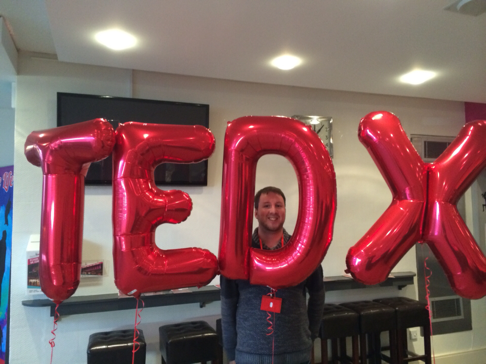
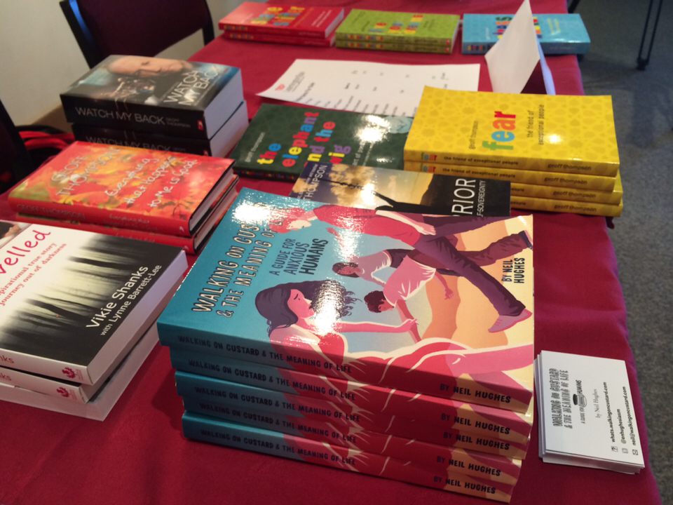

Saturday was a huge day for me!

I've _finally_ made the switch to almond milk, and reduced my dairy intake. It'll be interesting to see what effect this has on my morning digestion.

Also, I gave a TED talk at [TEDx Leamington Spa](http://www.tedxleamingtonspa.com/)!

<figure>

<figcaption>

Me, somewhat awkwardly standing with balloons.

</figcaption>

</figure>

My talk was all about anxiety. And custard, naturally.

I had ambitious plans for it. I wanted to get across the importance of openness about our struggles, both for our own benefit and for others.

I wanted to paint an overall picture of the journey from anxiety to less-anxiety, while sharing some mind management strategies.

And I wanted it to be as funny as possible, while not detracting from the seriousness of what I was talking about. Easy, right?

## So, how did it go?

<!--more-->

Overall, I found the almond milk to be nearly indistinguishable from regular dairy, and I'm hoping to notice the digestive benefits in the near future.

Inner critic: No, you moron. How was the talk?

Ah, well. It was a crazy day. I was on LATE. I had to get there at 10am, and then I wasn't on stage until 6:30pm, so that was a LOT of bouncing around and trying to stay focussed.

I had a fantastic time meeting the rest of the speakers: they were an incredible bunch of people doing fascinating things: international film festivals, AI, moon probes, superfast cars, anxiety & martial arts, sex addiction, creativity, video games and more... the program was packed with interesting things.

I have to confess that it was a relief at the start of the day to see all these accomplished, awesome people also struggling the with deer-in-headlights feeling of being about to go on stage and deliver a talk!

Luckily, all the speakers did a great job, and distracted me nicely from the impending moment when it would be my turn.

Still, the pressure built throughout the day, especially as I bumped into speakers who were already finished and were happily enjoying a beer while my talk rattled around in my head.

I was absurdly worried that my brain would randomly decide to delete it from my memory, so I was regularly checking it was still there as the day went on.

(I don't recommend this as a public speaking strategy... generally I don't do this, but I'm usually speaking in a more free-form environment, so this polished format was a little out of my usual comfort zone.)

Luckily, I'd done my preparation. Not only did I know the talk well, but at the dress rehearsal I'd even scouted out exactly which taps in the theatre splashed when activated, so I could avoid a typically-Neil comedy situation where I soak my trousers moments before the call.

Finally, the evening session came around, and along came my talk...

And it went great!

I got a lot of laughs, including a particularly big one for a joke I'd inserted between the dress rehearsal and the real thing, which was pleasing.

There were a few problems: the clicker they had on the day seemed a bit too keen, so sometimes when I pressed the button it jumped two slides instead of one. This led to a bit of back-and-forth on the slides, which spoiled a couple of jokes and reveals.

But I managed to joke my way through the unforeseen situation and kept it moving smoothly.

Many people even said that this slide-chaos _helped_, since part of the point of the talk is that things don't have to be perfect for us to be happy, and we don't need to beat ourselves up over little things.

I was really pleased by the reaction. Many people afterwards said it resonated, and that it's important to talk about anxiety in an approachable and useful way. A couple of people said it made them feel less alone, or that they'd seen a new way to look at some aspect of their mind, which was SO good to hear.

And plenty more said it had been hilarious, which I also loved :D

Even so, when I first came off the stage, my inner critic was in full flow:

Past Inner critic: You really screwed that one up. No-one will watch a talk with a mildly malfunctioning slide transition. There goes your chance to get the message out to more people, you idiot.

I'm pleased that I did a good job of recognising the voice of my inner critic (of course, I've had a LOT of practice!), and that I didn't listen to it very much.

But it definitely helped to hear that the audience had appreciated it as much as they did.

## You Can See It Soon!

It was a real privilege to speak at such an amazing conference. The organisers did an incredible job, and I was sad to leave for the long drive home.

A day is such a short time to spend in such delightful, interesting company as the audience, speakers and organisers.

Still, I'm delighted and proud that I did it. And I'm enjoying the aftermath of relaxing after a six-month journey of preparation.

And I REALLY can't wait to share the video with you all when it becomes available!

Here are some ways you can stay informed:

**If you want to be updated when the talk is available then [join the mailing list](https://www.walkingoncustard.com/mailing/), or [follow me on Twitter](http://www.twitter.com/enhughesiasm) or [like Walking on Custard on Facebook](http://www.facebook.com/walkingoncustard). Or all three!**

<figure>

<figcaption>

My book on sale with the others at the TED conference!

</figcaption>

</figure>

* * *
