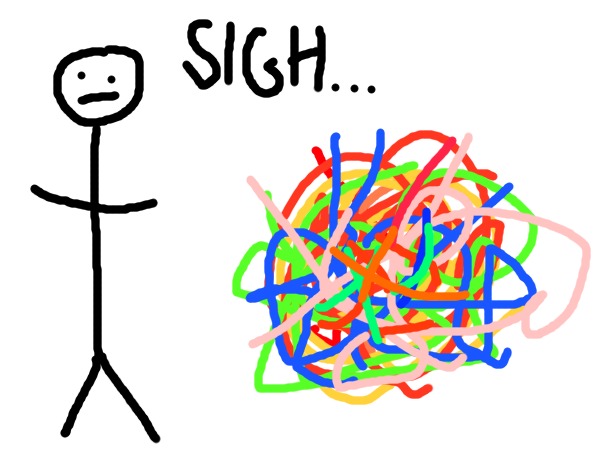

## I

Imagine that you're untying a giant tangle made up of many, many pieces of coloured string.

(I have no idea why you might be doing this. Presumably you're _very_ bored.)

<!--more-->

Perhaps you find a loose end, and are able to wiggle that piece of red string back through a loop. Now the red string is now slightly less tangled. But a bit of further investigation reveals that you can't go any further on that piece of string just yet. You have to go and find another opening somewhere else on the ball.

Luckily, it seems that now the yellow piece of string can now be approached in a way that it couldn't before. And _that_ leads to an untangling of part of the green string. And finally this creates an opening to work on another loop of the red string.

Gradually, by alternating between all the different bits of string as opportunities arise, you untangle the entire mess.

<figure>

<figcaption>

Why did I do this...?

</figcaption>

</figure>

Well done you.

## II

Do you ever feel as if you're constantly facing the same problems over-and-over? It's like someone - whatever idiot runs the Universe - has put your difficulties on repeat.

Nothing ever gets solved once and for all.

Loneliness at school. A flash of insight: "I'm too worried about the opinions of others!"

I need to self-validate.

Struggles making friends as an adult. Another flash of insight: "It doesn't matter how many friends I have."

I need to self-validate.

Problems maintaining romantic relationships. A now-familiar flash of insight: "I can be happy with or without a partner."

I need to self-validate.

Seriously. **_How many times do we need to relearn the same lessons?!_**

## III

So you wiggle the string marked "self-validation" and get it through the gap.

You tug at it eagerly and it dangles loosely. That's self-validation taken care of!

Except it's still part of the tangle, and the next bit seems to be hidden underneath something else. No more progress to be made there.

But that string marked "existential angst" is looser now...

## IV

Sometimes I read old diaries from my teenage years, and I'm _amazed_ (and more than a little embarrassed) at how similar my problems are today to the problems I had back then.

Everything I worry about is part of a recurring pattern, it seems.

Does that mean I'm not changing or growing? Am I, in fact, a massive failure for constantly repeating the same old cycles? Am I deluding myself to believe that I've grown and changed and become more capable?

I don't believe so.

Each time an issue recurs, I have the chance - if I choose to take it - to untangle just a bit of the string they're attached to.

Each time I untangle the whole mess just a little bit more.

## V

Life isn't literally a tangle of connected strings. \[citation needed\]

But if you're ever tempted to beat yourself up for repeating the same old patterns, perhaps it would help to think of life that way.

Maybe your particular tangle just requires you to return to the red string from time to time.

You'll get there eventually.
