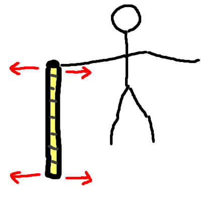
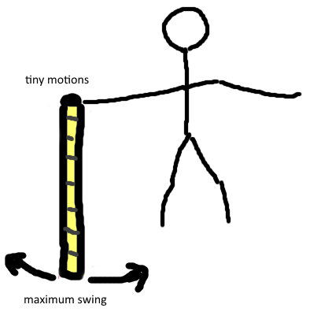

**_\[Warning: this post contains mild physics.\]_**

Imagine a short piece of rope. We'll call him Ropert.

Let's imagine that Ropert represents our lives.

<!--more-->

(Ideally without overthinking why a rope represents anything. It just does.)

There are a number of things you could do with Ropert. Let's start with the simplest: absolutely nothing. If you simply let Ropert dangle, then absolutely nothing happens.

**If you do nothing, nothing happens.**

This is a fairly obvious life truth. What's next?

Well, what if I started doing the _littlest amount possible?_

Well, imagine I hold Ropert and move him back and forth _VERY SLOWLY_. What happens?

The rope just moves along with my hand.

Inner critic: What's with the unreasonably long arms?! And... is that meant to be a rope moving slowly back and forth? Have you not heard of ANIMATION?

Can you imagine how bad my animation would be, if this is my doodle?

Inner critic: Fair point.

Anyway. Moving Ropert back and forth slowly just... moves him back and forth slowly.

**Tiny amounts of effort lead to tiny results**

So maybe if I use more effort, I'll get more results? Let me turn the dial up to MAXIMUM EFFORT and see what happens to Ropert. Imagine holding a rope, and moving your hands back and forth as fast as possible.

In this case, a strange thing happens. Shaking AS FAST AS POSSIBLE makes the tip of the rope remain stationary.

(Don't believe me? Get a piece of string or similar and try it yourself.)

Inner critic: ...

Inner critic: I expected nothing, and I am still disappointed.

The art doesn't matter. The point is that: **MAXIMUM ATTEMPTED EFFORT leads to thrashing around and zero results**

The sweet spot, then, is somewhere in the middle.

Imagine holding Ropert and starting out slowly moving him back and forth, and then gradually speeding up.

At some point something strange happens. The rope starts swinging MUCH further than I am moving it. Eventually I find a pace where I barely have to move my hand at all, and the whole rope is swinging back-and-forth at maximum length.

This is the _resonant frequency_.

When we swing Ropert at the resonant frequency, we hardly have to move our hands at all, but he swings around like a madman. Or mad rope. Or whatever.

**The exact right amount of effort creates results much larger than the amount of effort we put in.**

Physically speaking, pretty much everything has a resonant frequency. (It's not always a good thing. This is why sometimes bridges have to be redesigned, because they accidentally vibrate at their resonant frequency in the wind and shake themselves to bits.)

And it can feel as if our lives have a resonant frequency too. Putting in the right amount of effort into everything we do so that it _resonates_ is the real sweet spot.

As we've seen, not trying at all leads to nothing, trying too hard leads to nothing and trying just a bit leads to small results.

But finding the exact right amount of effort, applied in the right way, leads to the best results.

## What do I do about it?

What we need to change depends on what we're currently doing.

Are you currently flailing around desperately trying everything you can think of? Maybe you're in the MAXIMUM EFFORT failure zone, and slowing it down a bit will help you out.

Or are you hardly putting in any effort at all? (This one's easier to understand - generally we know when we could be trying harder and a gentle nudge would be helpful.)

The key point is that it's not always true that more effort equals more results. We have to figure out for ourselves how to find our resonance in our own lives.

_Does this post resonate with you? (Sorry.) Let me know_!
