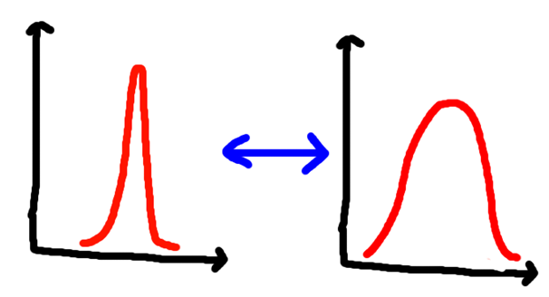

Today: some thoughts about life decisions.

### But First: Let's Talk About Fourier Transforms.

<!--more-->

_\[WARNING: THIS SECTION CONTAINS MATHS! (It's optional, so skip it, if you like.)\]_

A few months ago, I was making a decision, and every time I thought about it, a mathematical analogy sprung to mind.

You might have heard of the Heisenberg Uncertainty Principle, which says (broadly) that the more precisely you measure the _position_ of a particle, the less precisely you can measure its _momentum_.

(Occasionally this gets paraphrased as "you can either know where something is, or how fast it's going, but not both.")

This isn't just a weird fact about our ability to measure, and it's not even restricted to particles. It's just that this phenomenon is easier to notice at the particle level.

In fact, this is a fundamental reality. In mathematics, it's related to an operation called the Fourier Transform. (Very) basically, this operation is part of the translation between position and momentum. If you have lots of precision to start with, you end up with a fuzzy result after:

_Figure: The world's least accurate graph. A precise measurement becomes fuzzy after applying the Fourier Transform (blue arrows), and vice versa._

In other words, you _physically can't_ have high precision on both position and momentum at once.

(I am very much rushing this explanation, so it is not entirely accurate, but it's accurate enough for the purpose of this post. If you want to understand better, these [two](https://www.youtube.com/watch?v=spUNpyF58BY) [videos](https://www.youtube.com/watch?v=MBnnXbOM5S4) explain the mathematics in fantastic, intuitive detail, and without all the hand-waving inaccuracy.)

Anyway, let's go back to my life…

### The Last Few Years

I've spent the last few years writing books and articles, doing freelance programming, [giving comedy talks about mental health](http://bit.ly/custardTED), and doing standup comedy.

These years have been great fun… and very challenging. I've found a routine which - _mostly_ – works for me. But I've gradually become less and less settled, and it's been increasingly clear since I [finished my latest novel](https://puttylike.com/filling-the-gap-after-a-big-project-ends/).

This makes sense: I suddenly have a lot of extra time to reflect, which is always dangerous. The [most natural path](https://puttylike.com/i-do-therefore-i-am/) would be to continue as I am – perhaps start another book, find another programming contract, and book even more talks. But I didn't want to assume that the path I chose a few years ago was _automatically_ the right path for _now_.

So I've taken a few weeks to chew over the possibilities, doing some temporary coding work, but no new huge projects: only fun work which would teach me some new skills.

The whole time I've been exploring what lies beneath the unsettled feeling, and gradually I've realised that it's about _freedom_ and _security_.

### More of One, Less of the Other

I love the freedom of my current life. I get to choose which projects to work on, which clients to work with, and find places to speak.

But this freedom has downsides: most obviously, I don't have the regular income I used to. This is fine, but it has the potential to be exhausting over a long time. It feels as if I _must_ keep putting in effort just to remain static… and if the effort stops, then I fall behind.

I think this deep unsettlement is my brain trying to tell me it would prefer a _bit_ more security.

Easy, right? Problem solved, I can just do that, and never have _any_ problems ever again, li-

### Wait!

Oh. All of the options which will bring more security entail giving up some freedom. I'll have to take a job, or a long-term contract, or be less picky with clients, or _something_. And the parts of my brain which desperately want this freedom are in conflict with the parts which want security.

This is why the image of Fourier Transforms keeps resurfacing in my mind: I can have lots of freedom, or lots of security… but not both.

(Yes, _okay_, I admit that perhaps see-saws would have been a more accessible analogy, but if you can't nerd out about mathematical concepts at Puttylike, then where can you?!)

### There's a Middle Ground

For a brief time I felt stuck, as if there were only bad options: continue with the anxious grind of complete freedom, or declare failure, give up on my dreams entirely and do something else.

You might recognize my old friend "extreme thinking" in that description of the situation. For some reason, my human brain assumes all compromise is total capitulation. Instead, I _could_, for example, take a part-time job, and trade some freedom away for a little more security.

Changing my approach isn't the same as declaring failure, either. It just means I'm recalibrating the amount of freedom/security which I want at this point in my life!

### Takeaways

Here are the reminders I'm taking forward for _next time_ I have to recalibrate what I'm doing with my life:

- There _will be_ a next time I have to reconsider what I'm doing

- Just because I'm already doing something, doesn't mean I have to keep doing it.

- Sometimes I need more freedom, sometimes I need more security – I have to choose what balance I want right now

- Rebalancing isn't the same as failure

- Maths is cool, even if I'm terrible at explaining it

Currently I'm seeking some very cool part-time work which will give me that security (while being fun, challenging, interesting work!) while leaving me space to work on the next book and continue to give talks. I hope it's useful to you to hear about this process, as messy and unfinished and full of catastrophic thinking as it is. At the very least, it's hopefully good to hear I don't have everything all figured out - I always find it reassuring to remember that I'm not the only one who isn't quite sure what they're doing!
