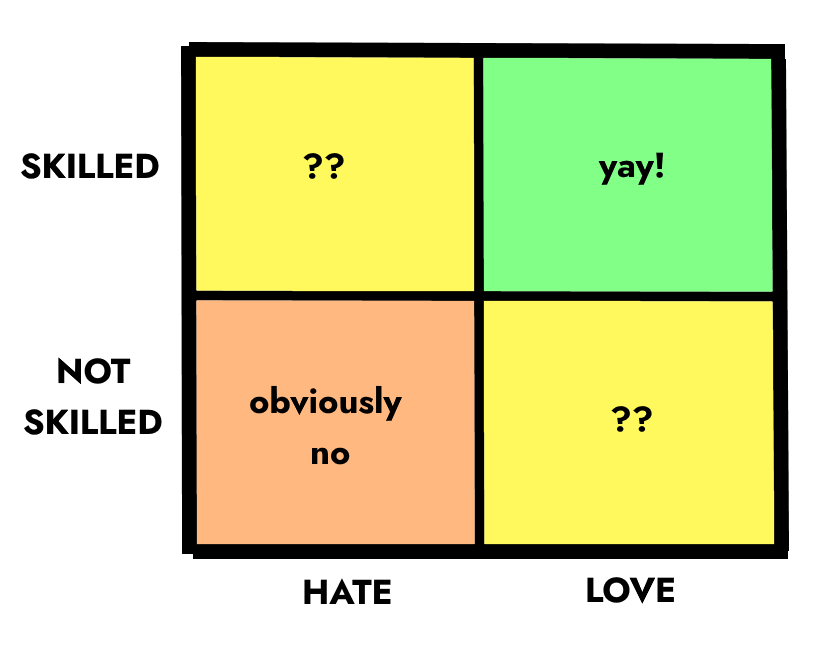
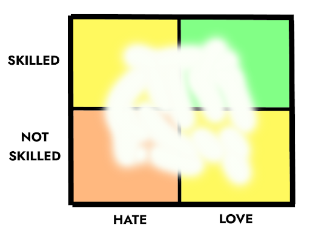

Being skilled is a curse.

I don’t mean to sound conceited. (How could I be? One of my very best features is my world-beating humility.) **It’s just that…when you _can_ do something, it’s easy to feel like you _should_.** 

<!--more-->

Would I be a respected scholar if I’d stuck with academia? Or a well-known comic if I’d committed more to it? Probably not. But regardless of how realistic these thoughts are, it can be painful to imagine what I might have achieved if I’d chosen to allocate my time differently.

> We humans struggle to understand our own skills and desires.

Paradoxically, it’s [fear of](https://puttylike.com/how-to-get-over-multipotentialite-guilt-and-wasted-talent/) [unrealised potential](https://puttylike.com/how-to-get-over-multipotentialite-guilt-and-wasted-talent/) which has often driven me from one option to another: _Sure, I could stick with this… but then I’d never get around to THAT!_ Unfortunately, this isn’t a sustainable system. I end up reacting to whichever gut pull is strongest at any given time. Assessing what I’m good at is exhausting enough. What about figuring out what I actually like?!

The old adage “follow your passion” only adds to my confusion. What if I suck at my passion? Or I don’t quite know what it is? Or _\*gasp\*_ I have multiple passions?!

In short, we humans struggle to understand our own skills and desires. The (frankly absurd) level of difficulty we face when trying to make objective observations about our lives can lead to [paralysis, confusion, overwhelm and difficulty making choices](https://puttylike.com/why-youre-so-confused-about-what-you-want/).   

Luckily, we have charts and graphs! One way to get some perspective on this dilemma is to plot the ways we spend our time on a chart, placing the things we love further to the right, and the things we’re better at higher up. This places each activity into one of four quadrants:

In theory, this chart makes decisions very simple. Love something you’re good at? Do it more! Hate something you suck at? Avoid it!

The two yellow quadrants—where you _either_ love something _or_ are skilled at it—are a bit more complicated, but there is still a benefit to comparing the position of each option against the others. For example, I did some thinking about my favourite subjects from my school days in my extremely normal and definitely real British school:

As you can see, divination came naturally to me–and who doesn’t love predicting the future? I always aced a thermodynamics exam and was still out on the green in time for flying practice, but the actual calculations felt tedious to me. And, while I enjoyed sewing a big floppy hat, I was utterly terrible at it and the blot on my exam record haunts me to this day. 

Of course, a love-skill plot doesn't have to compare academic options. I could plot the five or six various activities which make up my current career. Or, I could use the chart to decide which hobby to prioritise in my free time.

There’s also no right way to interpret the data. Depending on my goals, it might lead me to:

1. Completely avoid the options in the bottom left

3. Focus solely on those in the top right

5. Prioritise the things I love, regardless of skill

7. Prioritise the things I’m good at, regardless of enjoyment

9. Aim to love the things I don’t enjoy as much, but am good at

Or…you get the idea. **Presenting our options in a novel fashion can lead us to new conclusions.** But, what if you _can’t even tell_ whether you’re enjoying something or not? Or if you’re good at it?! Those might sound like silly questions, but...

## **Knowing ourselves is harder than we think**

For starters, there’s a famous result in psychology called the [Dunning-Kruger effect](https://en.wikipedia.org/wiki/Dunning%E2%80%93Kruger_effect), which says that we humans are often pretty bad at accurately judging our own skills and knowledge. It makes sense when you think about it: the ability to accurately assess a certain skill often develops _after_ mastering the skill.

This effect makes me inherently mistrust my self-judgement… before I even address the huge swings of self-doubt—or, more rarely, over-confidence—that plague me from time to time. Knowing if we’re good at something is actually fairly difficult.

You’d think it would at least be easy to tell if we _like_ something or not, though. But, deep into an activity or career, I’ve often been struck by the sudden realisation that I’m not enjoying myself. I expect it’s a universal experience to stick to an activity or habit or tv program for _years_ before realising we actually just don’t like it as much as we thought. Our routines become habits, and we can go for long swaths of time without really assessing how we feel about them.

Even worse, our brains treacherously enjoy simply being good at something. We can fool ourselves into thinking we like an activity when really we just enjoy the feeling of accomplishment.

So, any real-world attempt to plot these charts of ‘how much we like something’ versus ‘how good we are at it’ is likely to be cloudy at best:

How do we _really_ tell whether we love an activity? Or whether we’re any good at it? Let’s peer beneath that mysterious cloud of unknowing.

## **What is beneath enjoyment?**

Taking time to ask yourself _Do I really like this?_ can lead to surprising results.

If asked, I might _say_ I like watching television. But if I actually paid attention while I was doing it, the experience might go something like:

- Joylessly scroll through options on a streaming platform

- Half-heartedly pick a program

- Get distracted while watching

- Scroll aimlessly on my phone while vaguely paying attention

Similarly, I might _say_ I don’t enjoy working, if someone asked. But in reality I often get lost in it for hours and feel happy afterwards. My simple intuition about what I think I enjoy can be misleading. To figure out what’s happening for any given activity, it helps to go a layer deeper and consciously ask “_what_ do I like or dislike about this?” Pick an activity, and make a list of all the possible facets of it that you like and dislike, and how strong they are.

For example, rating a job I used to have, I might say:

- I like the acclaim (+1)

- I like the feeling of flow that I get sometimes (+10)

- I dislike how long it usually takes to get into that flow (-3)

- I dislike the feeling of ‘having to do this’ (-3)

- I like feeling that I’m good at it (+3)

- I like that I get paid for it (+5)

- I dislike the AMOUNT I have to do (-3)

It would be tempting to conclude that ending up on +10 means I like it, but these tallies are always in flux and giving them a final number makes them seem more objectively true than they are.

In reality, any answer to “do I like this?” is a fiction—there isn’t one internal score that goes from ‘love’ to ‘hate’, just a messy average that fluctuates with time and mood. (This helps explain why we have those moments of realisation that we don’t like something after all: the internal calculation may have changed without our consciously figuring it out.) As a result, making these lists won’t reveal an accurate score for liking something, but _it’s not supposed to_. The idea is to sort activities in relation to one another, i.e. put them into an approximate left/right order on my plot, and then use that to make decisions about where to focus my time and attention.

## **The real truth about "how good you are**"

Our emotions may be messy and clouded, but surely our level of skill at a certain task is more clear cut?

In many cases, our skill level _is_ obvious: we don’t need to be told that we’re good at basketball, mathematics, accounting or parkour. The results (or, in my case, the dire injuries) speak for themselves. But when it comes to anything subjective—art, poetry, comedy, singing or even the use of language—it can be difficult to assess our true level.

Over-confidence, under-confidence, self-doubt and comparison all conspire to confuse the picture. Awareness of the Dunning-Kruger effect—where beginners tend to overestimate their ability and experts underestimate it—help to compensate for some of the confusion.  A more reliable path to clear-sightedness lies in seeking a range of opinions.

After all, there’s no such thing as The Real Truth About How Good You Are At Poetry. But, while you can’t be objectively sure how good your work is, you can discover how _popular_ it is—and then decide for yourself [how much that matters to you](https://puttylike.com/why-you-should-do-something-badly-today/). Statistics like _90% of all humans think my poems suck_ or _Everyone who’s read them genuinely likes them_ give you some amount of information about your work. That information can help you make a judgement about your ability.

You don’t need to develop a universal scale for how skilled you are. Just sorting your options from “relatively terrible at” to “relatively great at” will help you determine where different activities fall on the graph.

## **The nagging missing factors**

It’s almost certain that, after evaluating your activities on enjoyment and skill, you’ll have a nagging feeling that haven’t arrived at the whole story. That’s because enjoyment and skill are only two factors of many.

It’s common to _value_ a task without being good at it OR liking it. Many daily tasks fall into this category for me. I don’t like laundry—nor am I especially talented at it!—but I value it, so I dedicate time that I could be using elsewhere.

Another dimension might be _necessity_. I don’t enjoy trudging through the desert back to civilisation after being stranded, nor am I good at it, but there are situations (well, one situation) in which it would be absolutely required to do so. Many jobs in our lives are neither fun nor natural to us, but we have to do them for one reason or another.

An incomplete list of extra factors:

- Value

- Necessity

- Social status

- Opportunity cost

- (Im)possibility

It’s not feasible to plot all of your activities on all of these dimensions. (If, like me, you love a spreadsheet, you might have fun rating all of your options on every dimension you can think of and drawing conclusions from the numbers you come up with!) Even without taking a strictly mathematical approach, reflecting on the necessity, value, or status of different tasks is worthwhile. All these factors can help in choosing what to prioritise.

> Looking at your skills and passions, are there novel ways you could mix them? Or could you somehow apply your unloved skills to the activities you do want to do?

## **How to apply your observations**

Sometimes, these sorts of reflections lead to obvious conclusions. If you identify unnecessary activities which you hate/are bad at, then you can cut them out to spend more time on the things you love/are good at. What other conclusions can you draw? 

Looking at your skills and passions, are there novel ways you could mix them? Or could you somehow apply your unloved skills to the activities you do want to do? For example, I never wanted to be a career comedian, but I do enjoy standing on stage and making people laugh, so I’ve found a way to use these skills to give [humorous talks](https://enhughesiasm.com/speaking/) instead. Similarly, my friend Emilie doesn't particularly enjoy her work as a web designer, but she uses those skills frequently to support her other projects.

After all is done, if you’re lucky, you may be left with [a choice between multiple good options](https://www.walkingoncustard.com/making-good-choices/). In which case, don’t worry.  [There’s no single right answer](https://puttylike.com/how-to-choose-the-right-path-when-there-are-so-many-possibilities/). An ideal life doesn’t have to be purely passionate. Sometimes it’s a great choice to do things we don’t like for the skills or experiences…or simply the money. Or, you may still be figuring out which options you prefer. It’s okay to [experiment for a while](https://puttylike.com/6-experiments-to-help-you-recharge-when-youre-feeling-drained-and-weird/).

We rarely have perfect clarity on what to focus on. But, by digging deep into those things we enjoy and investigating how they overlap with the things we’re good at, we can get a little more clarity on what to do right now.
