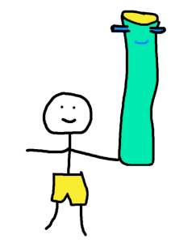
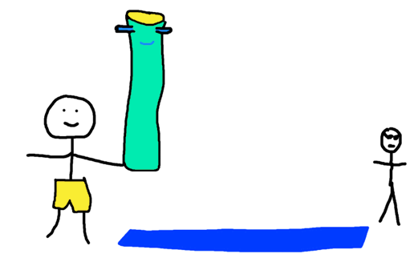
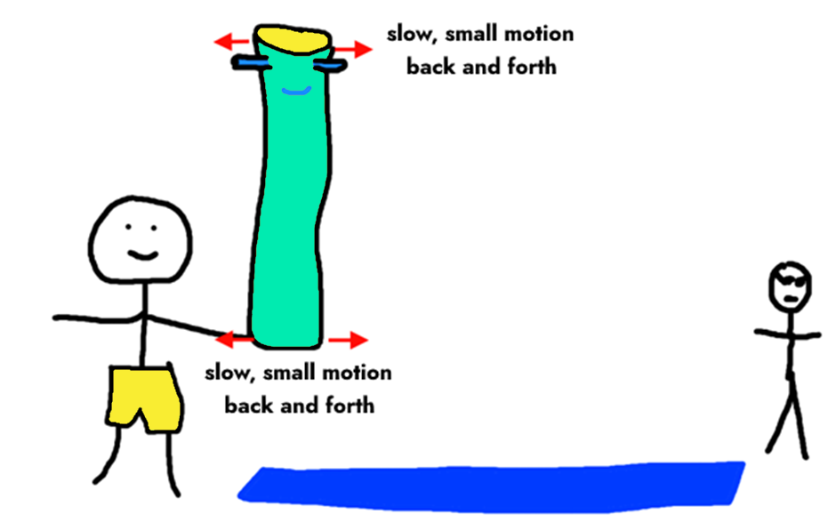
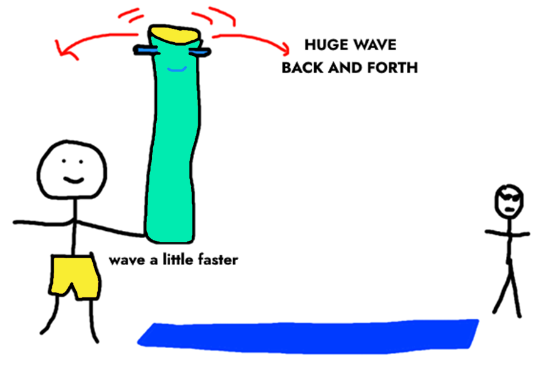
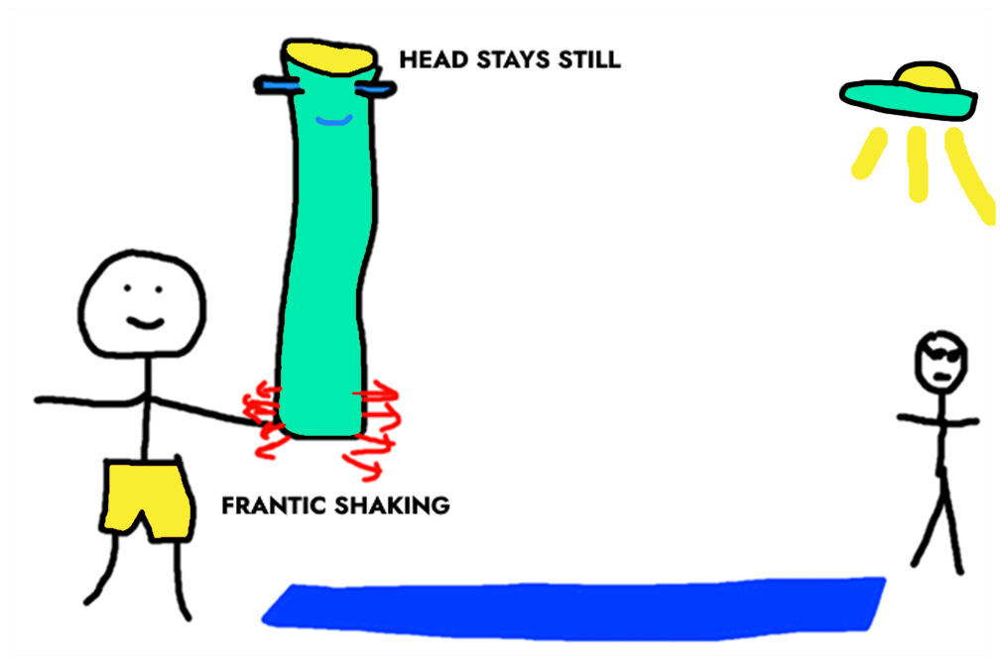
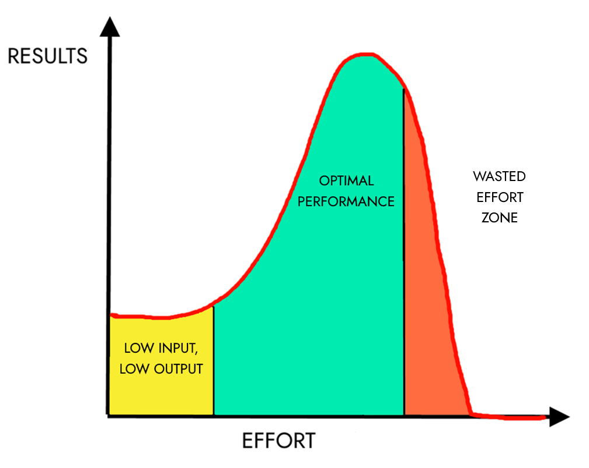

Most of the time I feel I ought to be trying harder. Sometimes, this feeling is correct: there are days when I need to put down the distractions and _just get on with it_, whatever “it” happens to be.

But often, I have the opposite problem.

<!--more-->

I need to scale back my efforts, or make them more focused. It’s hard to recognize that trying too hard can be troublesome, but the fact is that applying the wrong amount of effort to a problem (be it too little or too much) will always produce inferior results. **It's hard to mow a lawn with a pair of scissors, but it’s equally ineffective to tidy your bedroom with a bulldozer.**

Intellectually, I understand this, but it still feels wrong to me. _Trying harder doesn’t always improve things? The horror!_ I suppose I’ve internalized a broad societal belief that “more effort = more betterer”.

However, I’ve found that using what I know about physical sciences as an analogy for the rest of my life can help to resolve my confusion. In particular, the problem of trying too hard becomes clearer if I picture an imaginary pool noodle in a highly contrived situation. Allow me to demonstrate, using a pool noodle named Ned.

Imagine that while hanging out with Ned at the pool, wearing my stylish swimming shorts, I see a friend looking sad.

I’d love to cheer up my friend, but it’s hard to get their attention across this extremely large and well-drawn pool. Luckily, I could signal them using Ned!

If I don’t try very hard, then Ned will follow my movements exactly as I slowly wave him back and forth:

This isn’t very attention grabbing. My lack of effort leads to limited results, just as we might expect.

But if I try just a little harder, Ned waves back and forth wildly:

<figure>

<figcaption>

A slightly faster motion leads to much greater results.

</figcaption>

</figure>

This is perfect! I’m getting huge results without putting in much more effort.

Swinging anything back and forth at the right frequency is easy — so easy that it’s actually difficult to do it too slowly or too fast. You’ll feel resistance if you try to swing a pendulum at the ‘wrong’ pace: it ‘wants’ to go at its own frequency. I’m reminded of this whenever I work so late into the night that my productivity for the next day is ruined.

The physical analogy is that when we exceed that perfect frequency — whether we’re swinging pendulums or waving noodles — results get worse. Fast. 

Back at the imaginary pool, let’s imagine my friend is about to be abducted by a UFO — a sadly common occurrence at fictional hangouts such as these. Desperate to warn them, I shake Ned back and forth so fast that he barely moves at all:

Once I’ve surpassed the optimal frequency of waving, the harder I try, the _less_ Ned moves. There's no way we'll catch my friend's attention like this. My frantic effort is no longer translating into increased or improved results.

Let’s put what we’ve learned into a graph, and see how all this applies to the problem of trying too hard in general.

There are three zones. At first, small effort leads to small results. As we increase effort, we build toward the peak, where the perfect amount of effort achieves maximal results. Beyond that, there’s a steep drop-off: additional effort goes completely wasted and can actually lead to _worse_ results than barely trying at all.

This silly pool noodle analogy illustrates _why_ trying too hard can be less productive than hardly trying at all. Even though there is more effort overall, it's opposing itself. **Some of the effort pulls one way; some pulls the other; and the net result is zero movement and maximum exhaustion.**

## How to recognize the Wasted Effort Zone

So, how do we know when our effort is going to waste? For me, the natural impulse is always to do _more_. 

Here are some tell-tale signs that you may be trying too hard:

- Unproductively jumping from one project to another

- A lack of progress, where you're also not learning anything that you can use in the future

- Fantasizing about other projects as soon as you pick up any particular one

- Feeling stuck, and also as if you urgently need to get unstuck

- Cycles of starting, overthinking, deleting, restarting

- Efforts seeming disproportionate to the results they produce

- Intense feelings; a belief that the stakes are high

If you recognize these signs, remember your friend Ned the Noodle and resist the temptation to keep blaming yourself for not trying _enough_. Any further attempts to accelerate might only make it worse.

**Our ‘hustle’ culture forgets that steady speed beats acceleration into a wall.** We lose productivity from overwork. More important, it comes at the expense of other things in our lives—unchecked exertion leaves us exhausted, frustrated, and with worse results than if we’d just done a little at a time.

I find it hard to believe, but **sometimes the answer is simply to slow down**. Ideally, that slowdown brings us closer to that optimal state where maximal results are possible.

When I’m stuck in a loop of wasted effort, my brain interprets any attempt to escape as laziness. Next time I’m tempted to accelerate forward, all noodles blazing, I’m going to give myself a reason to pause. It’s important to keep trying…just not _too hard_.

I’ve learned many lessons from the inevitably of failure and the biggest is this: **it isn’t necessarily the end of the world.**
