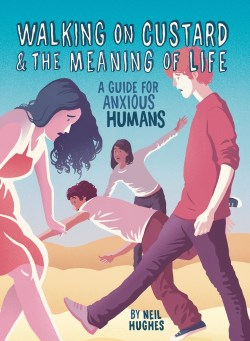

Like most humans, Neil Hughes gets anxious.

But he’s no longer hiding and pretending that everything is okay.

Instead, he's written a book about it. And his Inner Critic isn't pleased with this decision... <!--more-->

[Click here to sample the first few chapters for FREE!](https://gallery.mailchimp.com/f16d438b230e1f3c54ecd5adc/files/Walking_on_Custard_the_Meaning_of_Life_Sample_01.pdf)

* * *

\[caption id="attachment\_96" align="alignleft" width="250"\] This is the book cover!  
(I know that's obvious, but captions usually are.)\[/caption\]

Hello. I’m Neil’s Inner Critic, the voice in his brain that reminds him how useless he is.

I warned him that a ‘comedy’ book for the anxious would be a guaranteed disaster. Especially if it was an idiot like him writing it.

But he ignored me, so this is my final bid to save humanity from reading his nonsense.

It’s full of embarrassing stories I can’t allow you to hear. And ‘helpful’ waffle about trading anxiety for contentment.

Neil claims it’s “a warm, humorous and useful manual”, and that he wishes he could have read it when he was struggling with his own anxiety.

Then he babbles about happiness and the meaning of life. (And something COMPLETELY ridiculous about custard.)

Please believe me. Stay away from this book. Save your inner critic… while you still can.

 

* * *

Occasional comedian and full-time worrier Neil Hughes isn't the kind of person you'd expect to write a helpful book.

He's an idiot.

Or, at least, so his Inner Critic is constantly telling him. No wonder he's suffering from anxiety!

But during his nervous bumbling through life he somehow learned how to reduce his anxiety and quit his unhelpful mental habits.

Oh... and he stumbled on the Meaning of Life, too.

Now he's sharing a combination of hilarious real-life stories, inventive fantasy fiction and badly-drawn graphs to help you to be less anxious and more happy.

In this compelling, surprising and delightful guide to life for humans, Neil explores how to (gently) uproot anxiety, all while battling the irritating interruptions from his doubtful Inner Critic.

Then - after sorting out love, crises, relationships, purpose, and contentment - he even considers how we can deal with death and the Meaning of Life itself.

And, somehow, it turns out everything can be explained using custard...

[I'm interested already! Where can I get it?!](https://www.walkingoncustard.com/purchase/)

* * *

## What Others Have Said:

> Hughes offers a humor-filled and useful guide for anxiety... disarmingly relatable.[Publishers Weekly](http://www.publishersweekly.com/)

> Neil has a pleasing use of commas.Anonymous

> It’s not bad, I suppose.Neil's Mum

> This idea that could have easily gone so badly, has turned out wonderfully. It is a thrilling mixture of stories, experiences, lessons, and well, custard.[Books & Bee](http://www.booksandbee.com/blog/book-review-walking-on-custard-and-the-meaning-of-life-a-guide-for-anxious-humans-neil-hughes31/3/2015 "Books & Bee")

> it is a bookIsla McLoughlin, aged 2-and-a-half

> [5 stars.](https://www.goodreads.com/review/show/1244783155?book_show_action=true&page=1) A must read for anyone suffering from anxiety, minor or major it doesn't matter... it's helpful, funny, and insightful. [Tragically Dull Adventures of an Almost Librarian](http://barbarianlibrarian1.blogspot.co.uk/2015/04/walking-on-custard-and-meaning-of-life.html)

> To merely call it a self-help book would be a complete disservice to the author. Part biography, part guide, and part Brother's Grimm Fairy Tales of the Strange... if only I had read this growing up then I might not have felt so alone.[Claire Eastham](http://weallmadhere.com/2015/04/12/walking-on-custard/)

> Great book, would recommend to anyone... which brings me onto my only criticism: The title. This book is definitely not only for anxious humans.
> 
> I wouldn't consider myself a sufferer of anxiety, and have enjoyed it immensely and found it really helpful.
> 
> ["Sambi", Amazon reviewer](http://www.amazon.co.uk/review/R1F6NTII1NEF5D/ref=cm_cr_dp_title?ie=UTF8&ASIN=0993166806&channel=detail-glance&nodeID=266239&store=books)

> I snorted on the train. In the middle of rush hour. People looked at me. I was reading your book. You're an idiot.Amy Burke

> Hughes’ down to earth, sometimes silly, humour and self-deprecation make him an ideal guide...It's clearly a book that has a lot to offer anxious humans everywhere. It’s inspiring without being over-ambitious; challenging without being preachy; insightful without making you cringe (too much!); and funny without being dismissive...
> 
> It achieves what many self-help books lack: warmth, humour, and relatability, but without compromising on wisdom, insight, and practical, useful advice.
> 
> [Sarah Graham](http://sarah-graham.co.uk/2015/06/17/review-walking-on-custard-neil-hughes/)

> I really, really enjoyed it. I recognised myself a lot and beyond finding it a charming and funny read, I also found it a helpful one.
> 
> It is a brave book and a noble one because, really, what better thing can a person do with their own suffering than to use it to try and help others.
> 
> It's on my read-this-again shelf.
> 
> [Nathan Filer, author of 'The Shock of the Fall'](http://nathanfiler.co.uk/)

> When reading it on a sunny day the black letters glisten mesmerisingly against the paperRoger Wood

<table class="purchaseTable"><tbody><tr><td style="text-align: center;" class="fullLink"><a href="http://buy.walkingoncustard.com/" class="tdLink">
Get the book now!
</a></td></tr></tbody></table>

* * *

Features illustration by the marvellous [Tom Humberstone](http://www.tomhumberstone.com "Tom Humberstone")

(and also some considerably less impressive doodles by Neil Hughes)

Smiling icon made by [Freepik](http://www.freepik.com "Freepik") from [www.flaticon.com](http://www.flaticon.com "Flaticon") is licensed under [CC BY 3.0](http://creativecommons.org/licenses/by/3.0/ "Creative Commons BY 3.0") (colour inverted version is by me).

