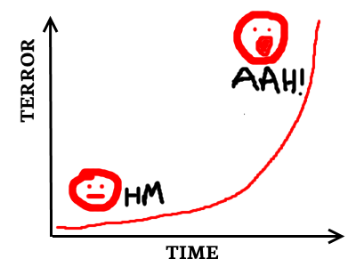

Things, in general, can rapidly spiral out of control.

<!--more-->

In particular, anxiety can go from a tiny feeling of unease to a full-on panic attack very quickly. Even if it doesn't become panic, a stray scary thought can develop into an obsession that's very difficult to shake.

After a while, the horrible familiarity of these scary thoughts can be an awful experience on their own. I've had thoughts come into my head and immediately tried to batter them down, knowing that if I latch onto them that I won't get anything done for the rest of the day (at least) as I obsess over whatever they may be.

I've found the simplest tactic to prevent anxiety spiralling out of control is this:

**_Stop viewing anxiety as the enemy._**

Immediately, if you're anything like me, there will be a cacophony of resistant voices in your mind, each frantically pulling apart that idea:

WHAT?! But anxiety IS the enemy! I HATE anxiety!  
That's the stupidest idea I ever heard. Don't listen to this guy.  
How can that help? Surely if we accept anxiety, we'll just be anxious forever, and that's BAD.

These voices are [yet another strand in the tangled knot of anxiety](https://www.walkingoncustard.com/untangling-anxiety-first-step/ "Untangling Anxiety: The First Step"). They are an immediate distraction, demanding we deal with them rather than address whatever idea we're considering.

But, I promise, ceasing to resist anxiety is a powerful weapon. Here's why:

When we resist anxiety, we are telling our subconscious that anxiety is unpleasant. That _anxiety is something to fear_.

These creates a feedback loop. Fearing anxiety just gives us _more_ to be anxious about. This makes us more anxious. Which gives us more to fear. Which makes us more anxious. Which gives us more to fear...

Viewed via a Highly Scientific Graph, this looks something like this:

<figure>

<figcaption>

When we are anxious about anxiety, terror gets out of control.

</figcaption>

</figure>

On the other hand, if we don't fear anxiety, the Highly Scientific Graph looks more like this:

<figure>

<figcaption>

If we don't fear anxiety, we don't feed it and make it worse. It remains, but doesn't spiral out of control.

</figcaption>

</figure>

Imagine if, when an anxious thought comes into my mind, instead of reacting with more anxiety I reacted with boredom:

"Oh, it's THAT thought again. How very tedious."

Or, perhaps, with excitement:

"Yay! Hello, _thought-that-I-might-have-an-undetectable-disease_, great to see you again!"

If I react in this way, I don't add extra fear to my initial anxiety.

Reacting like this isn't easy. It requires going against our instincts: it's perfectly natural to be anxious about something unpleasant.

But it is _possible_ to react with boredom, enthusiasm, joy, or whatever other emotion we choose. It isn't _inevitable_ that we must react to anxiety with more anxiety. There is no Law of the Universe which says we must be anxious about anxiety itself.

Once you view it like this, it becomes (sort of) obvious that trying to be less anxious about anxiety may be a solid strategy.

But [obvious things aren't generally obvious except in hindsight](https://www.walkingoncustard.com/novelty-blindness-fresh-perspectives/ "Novelty Blindness & Fresh Perspectives"), so there's no need to feel guilty about that!

Of course, this doesn't magically solve all our problems. There's no simple cure-all to be free of anxiety forever. BUT this helps us to not make it any worse.

Which leaves us with more resources to get to work on whatever the root of our problems actually IS. Like those tigers that Little Billy keeps accidentally letting loose.

* * *

PS This post began life as a strange extended metaphor about a picture of a cat walking away from an explosion. It's a bit more useful without all of that nonsense, though.
