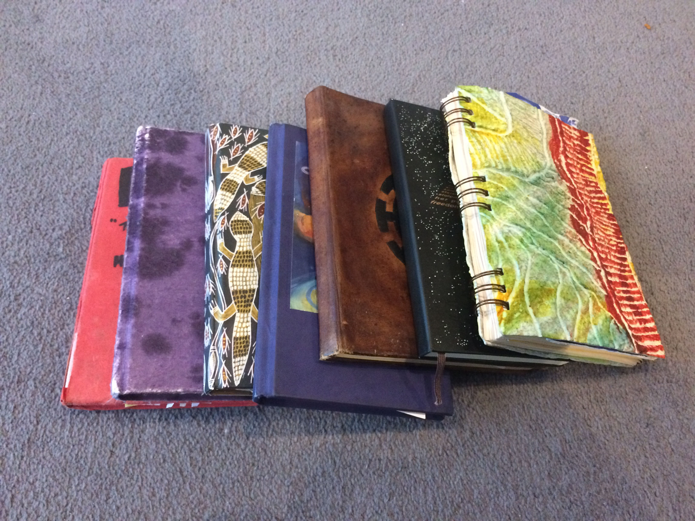

_\[ORIGINALLY POSTED December 2015.\]_
_\[UPDATED January 2017 and January 2018 with a few new awards.\]_

I'm legitimately shocked.

I just wondered how far back my annual tradition for reviewing the year with awards went, so I looked it up...

And it turns out I've been handing out yearly awards since 2003. TWO THOUSAND AND THREE!

<!--more-->

I thought the ten-year anniversary might be coming up, but _apparently_ I missed that two years ago. _\*gulp\*_

Anyway. Since 2003 (!) I have handed out an evolving series of end-of-year awards, which I call "The Awards", because apparently I am not very imaginative.

This began very simply. I thought it would be fun to have an end-of-year awards ceremony for the people who had mattered the most during the year. So I started with just a few basic awards for my Favourite New Person, or Most Improved Friend.

But over the years it has grown into a bigger process which helps me to take stock and choose a direction for the year to come. As well as honouring (or annoying) the people who have had the biggest impact on me over the last twelve months.

When I tell people about this they usually want to know more, so I'm sharing the process now in case anyone wants to adapt it for themselves.

It goes something like this...

## The Awards Process

First, I find a nice cafe to sit in\*, and I take whatever notebook I'm currently using as a diary.

If I was starting again I'd probably keep a dedicated notebook just for these annual awards, but originally they shared with the notebook I doodled and sketched and wrote random things in, so the awards are now spread over multiple books.

\* the nice cafe is NOT\*\* optional  
\*\* I mean, it is obviously optional if you really don't like cafes

Here are some of the notebooks I've filled in the last twelve years:

<figure>

<figcaption>

I \*think\* all the awards are in these ones, but I might have missed a notebook or two.

</figcaption>

</figure>

### The Rules

There are a few rules to consider before we begin:

-   **This MUST take place in January.** No cheating by doing it at the end of December!

Technically the year is _not_ yet over, and anything could still happen. What if I gave out an award on the 30th December, only to find on the 31st that it should have gone elsewhere? Disaster, that's what!

Now that I think about it, that's the only rule. Moving on...

### Step One: The Annual Review

Using my diary (or actually my Google Calendar, these days), I go through the year from January and write a little bit about the important things that happened, the places I went, the things I did, the people I met, highs, lows, etc.

This is fairly free-form. I'm not allowed to worry about getting it all down, or in the right order, or anything like that.

It's always amazing how much I forget that I've done until I put in the effort to go back over it.

"Oh, this is the year I did THAT? Amazing!"

This little chronological review gets the memories flowing so I'm ready to tackle the main event...

### Step Two: The Awards

This is the exciting, headline bit!

For each category (more on those in a moment) I write all the nominations as they come to mind.

Then I choose a winner and write that down (in special red pen, though that's not an important detail), including a little explanation as to why, and what this person/thing/event meant to me.

Here are the categories I used in 2014:

1. **Favourite New Person** - Who is the best new person that I met for the FIRST time in this calendar year? (You're only ever eligible to win this ONCE so you've got to put in the effort early if you want to win it :p)

2. **Most Improved Friend** - This one's actually really lovely: Who did I grow closer to this year? This has to be someone I knew already (i.e. everyone who WASN'T eligible to win Favourite New Person). Reading back the winners of this over the last twelve years is like reading a list of the best people I know.

3. **Best Memory** - What moment comes to mind as my favourite one from this year?

4. **Most Exciting Moment** - Not necessarily the same as the best moment!

5. **Most Frightening/Worst Moment** - Can be fun to look back at these in years to come, believe it or not.

6. **Miscellaneous Award** - At this point I like to arbitrarily give an award to 'something'. It can be a good cup of coffee I remember having, a random stranger I talked to once, an unusual experience - what random memory jumps to mind from this year that would be good to honour and remember?

7. **Quote of the Year** - In recent years I'm ashamed to admit I have often won this myself. I should maybe rename it 'best joke I made this year', to make it more honest. It used to be a good record of quotes from friends but I stopped keeping track, apparently.

8. **Family of the Year** - Sometimes whole families have been important, and deserve honouring at the end of the year.

9. **Place of the Year** - What place had the biggest emotional impact on me this year? Where will I look back on as "this year happened THERE"?

10. **Song/Film/Game of the Year** - Bit obvious, but maybe some media had a positive impact on my happiness this year.

11. **The 100% Clare Martin Award** - Awarded to the person who most deserves an award but hasn't won one yet in this process.

12. **Best Virtual Person** - A newish award I started giving to my favourite person I know purely through the internet from this year.

13. **Most Significant Blunder** - What's the worst mistake I made this year? Any lessons to learn from it?

14. **Greatest Life Lesson** - Any useful life lessons I could take from what's happened this year?

15. **Accomplishments List** - What did I actually accomplish in the previous year? It's amazing how even in 'bad' years there are usually quite a few things to still be proud of. And if not... that's what next year is for.

16. _New!_ - **Coolest Thing I Did** - Was there anything I can look back on that was particularly awesome?

17. _New!_ - **Most Uproarious Laughter** - This speaks for itself. Tough to remember, but these moments are worth holding onto if possible.

18. _New!_ - **Most Memorable View** - Just a quick one to note any particularly lovely views I experienced during the year

19. _New!_ - **Most Neil Moment** - What's a 'typical me' thing I did this year? (Whether funny or silly or brave or ludicrous or whatever.)

20. **To Work On Next Year** - Having looked back, usually by this point I find myself noticing a few things I'd like to do differently. A simple list of priorities for the coming year is helpful for starting the year with a positive mindset.

21. **Theme Of Next Year** - Is there a theme that ties together many of the aspects I'm planning to work on for next year? It's fine if not, but it can be helpful to identify a unifying theme, for example, "growth", or "stability" or "friendships". Or health. (Or anything, really.)

Sometimes I write a lot about each award category, sometimes it's just a sentence or two.

I find this to be a useful framework for thinking about all the different dimensions of life. It's incredible to read back and see what unusual moments or important people were at the top of my mind a decade ago.

Occasionally I realise something really significant happened that isn't covered by any award, so I create a new category.

As ever, there are no rules! (Except the above rule)

### Step Three: The Future

Usually by this point I've been writing for a while and I really can't face anymore, but I like to finish by writing a few paragraphs at the end looking to the year ahead.

_What am I hoping for? What good things are coming up? What challenges?_

I don't do "resolutions" but usually this whole process suggests some actions I can take.

Maybe somebody comes to mind that I'd like to get back in touch with. Maybe I realise I ought to change a few of my plans as I get a big picture overview of where I've been and where I'm going.

Either way, it's great to have a record of the last twelve years (!!!) in this awards form. I love going back and reading the old awards and seeing who/what/where was important to me at the time, and who/what/where has stuck around over the years.

If you decide to adopt this idea for yourself I'd love to hear how it goes for you, and what categories you decide to create for yourself.

**If you create any new awards, please share in the comments here** - maybe you have some award ideas I'd like to build into my review of the year when I do it next week :)

I hope you all had a lovely Christmas, and that the new year is full of great things for you.

See you in 2016 :)
