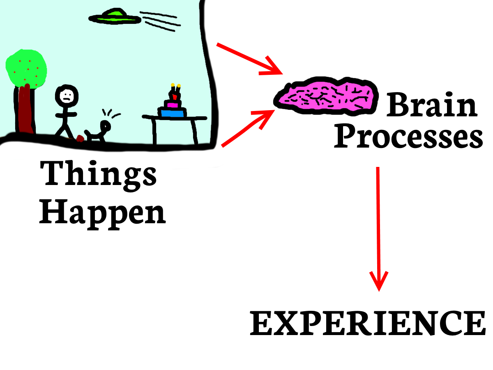

_We've Got The Whole World (In Our Heads),  
We've Got The Whole Wide World (In Our Heads),  
We've Got The Whole World (In Our Heads),  
We've Got The Whole World In Our Heads._

This homage to an old hymn gets weird rapidly after verse one, so let's end it there.

**Question: Is the whole world in our heads?**

**Answer: Depends on what you mean by "in our head".**

Let me explain, using this Highly Scientific Diagram of how we experience the world:

<!--more-->

As you can see, at Stage One, "Things Happen"

(I apologise for the technical language, bear with me here.)

Then, in Stage Two, our "brains" process whatever is happening.

(In this case, it looks like something to do with a dog, though I'm honestly not sure what the heck is going on. I'm sorry for drawing it.)

Finally, we actually experience the Things that are Happening. But because of Stage Two, this experience _includes all the filters added by our brain during processing_.

What are these filters? Basically any memory, association or understanding that our brains use to evaluate what's going on. Perhaps our particular brain absorbed the idea that "dogs are bad" at an early age, and now whenever it sees dogs it adds a "scary" filter to the experience.

The reason I'm calling it a 'filter' is because the scariness doesn't exist out there in the world - or in the dog! It gets added during the brain-processing stage, making it like a filter through which we view reality.

This may sound obvious, but from inside our human brains it doesn't feel like this is how it works; it feels like dogs (or whatever\*) are scary _in and of themselves_. Like a fish that can't see water, we can't see these filters.

\* If you're scared of dogs and are struggling to accept that the scariness lies in the filter, not in the dog, then imagine something that somebody else finds scary, like balloons, or fish, or lemons. It should be easy to see that the scariness comes from the filter - the feelings we have - being applied to the object, and not from the object itself.

## But does this matter?

Not necessarily. But it can be a problem if we forget that there are two levels going on:

1. What's happening in reality

2. The filters in our brains

When we experience anxiety, it may help to remember that _either one_ of these could be the cause. (Or both, if we're unlucky.)

Often there's a problem in reality that needs fixing. This is usually our default assumption: "I feel sad/scared, so something must be wrong".

But it's also possible that everything's okay (more or less), and the unpleasant feeling is coming from the filters applied by our brain.

And because it's so easy for these filters [to be invisible](https://www.walkingoncustard.com/novelty-blindness-fresh-perspectives/), we can spend months searching for non-existent problems in our lives.

In fact, that's pretty much the story of [my early experiences with anxiety](https://www.walkingoncustard.com/what-is-anxiety/). I was convinced there must be something wrong somewhere OUT THERE - in my job, social life, home life, something medical, and so on - but in reality, those things were fine.

It took me a long time to realise these brain filters existed and were affecting me so powerfully. And that it was in my power to change them.

## How can a filter be unhelpful?

Imagine translating a love letter written in a foreign language, using a dictionary where all the words for positive and negative concepts have been swapped by some enemy; **'love'** is now **'hate'**, **'kisses'** are now **'punches'**, **'your name'** is now translated as **'Hitler'**.

The letter is still the same - in _reality_, it's full of love and sweetness. But our _experience_ of it is awful, due to the dictionary applying a negative filter as we translate it.

Unhelpful filters in our brain colour our experience of reality in a similarly negative way.\*\*

\*\* Of course, we could be in the opposite situation of having unrealistically happy filters all the time. This seems like less of a problem, though I'm sure it still leads to undesirable situations. Ideally, we probably want our filters to be as 'clean' as possible, so we can react to the world how it actually is.

## Is this the same as saying anxiety or depression is "all in your head"?

No! The opposite, in fact.

"It's all in your head" sounds dismissive, implying that anxiety isn't real and that it's possible to simply wish it away. Not only does this pile unnecessary guilt and blame onto an already unpleasant situation, it's completely wrong.

These brain filters are just as real as anything else.

The main difference between the filters and the rest of the universe is that the filters physically exist in our heads (as complex structures of neurons, I expect), whereas the rest of the universe is - obviously - outside of our bodies.\*\*\*

Just because these filters are part of our brain doesn't mean we can easily control or change them. "It's in your head" might be an accurate physical description of the location of the filters, but it isn't anything more than that.

It's also worth remembering that these filters may be just one component of anxiety, [which is complex](https://www.walkingoncustard.com/untangling-anxiety-first-step/), and is often made up of multiple factors - life situation, chemical imbalances, thought patterns, and so on.

Cleaning up our mental reality filters might be only one part of dealing with anxiety.

\*\*\* You could argue, though, that these brain filters are the ONLY thing that's real, since everything we experience depends on our brain interpreting it for us, meaning in one sense absolutely everything is "only" in our heads. The philosopher Descartes was concerned that he wouldn't be able to tell the difference if an evil demon took over his brain and fooled his senses into believing everything around him was real when it actually wasn't (see also: The Matrix). If the demon controlled his private internal world, how could he ever know differently? It's probably best not to worry too much about this.

## What Can We Do?

This sounds like a solvable problem - once you've identified a faulty filter, you can just stop using the filter, right? Or ask someone else - who presumably doesn't have the same distorted set of filters - and use their advice.

But it's not that easy.

Firstly, any outside help has to make it through the same distorted filter. For example, if I suspect the way I'm viewing a situation is not helpful, I might ask a friend for a less distorted view.

This is a good idea in theory, but in practice my friend's reassurances have to pass through my filters in order to land. It would be so easy for a broken filter to dismiss their input with thoughts like "Oh, they WOULD say that, they don't really mean it," or "they don't REALLY know what it's like", or whatever.

Secondly, changing our filters is hard. The ones that cause us the most pain are often deeply ingrained - like low self-esteem, or perfectionism, or phobias.

However, this doesn't mean they can't be changed. I believe they absolutely can. Mind management is a learnable skill at which we can improve.

Once we've recognised one of our filters is unhelpful (which is a job in itself - lots of observation and experimentation required), we have to keep reminding ourselves that it exists. Don't let it become invisible again.

Then I find it helpful to regularly answer the question "what other ways of looking at this are there?" I seek as many alternate viewpoints as possible, even silly ones. Even if we don't immediately believe these new viewpoints, they at least remind our brains that other perspectives are available.

And perhaps over time we can find a more helpful perspective and adopt it into the habitual filters applied by the brain.

**Do you recognise any unhelpful filters your brain applies to the world? How do you deal with it?**
