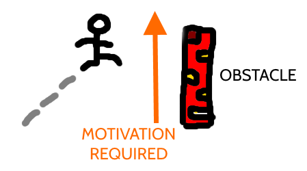
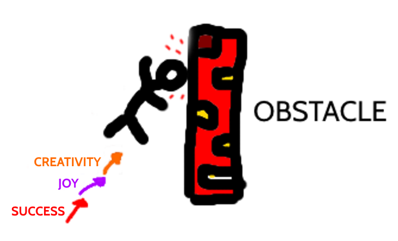
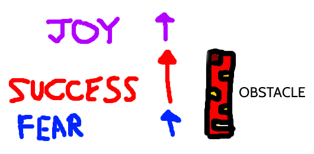

Now that I'm (mostly) successfully managing my anxiety, everything should be great forever... right?!

Well, no.

Obviously life isn't magically perfect. (Though of course "less anxiety" is a huge improvement!)

This is fine. I never expected perfection.

**But something else I didn't expect was that managing anxiety better could _itself_ cause problems.**

<!--more-->

You see, I've recently realised that I've spent most of my life being unconsciously motivated by _fear_. Fear of failure, fear of stagnation, fear of losing everything, fear of judgement... you name it!

Inner critic: Fear of elaborate cave systems?

Er, no. Not that one. But (some of) these fears fuelled me through school, university and then into my career. And I never noticed.

I've always thought of myself as quite driven. When I decide to do something, it usually gets done. Or I find a genuinely good reason not to.

So I've been surprised to find that this drive has diminished lately. I think I can explain why with some work-of-art diagrams.

Whenever we try to pass any obstacle, we need a certain amount of motivation, proportional to the size of the obstacle:

This motivation has to come from somewhere. When I was writing [Walking on Custard](https://www.walkingoncustard.com/the-book-for-anxious-humans/), I was motivated by the fear of failing to finish. (Naturally, part of me WANTED to write it, but a huge part of the will to fight to the end came out of that fear.)

I wouldn't say that I was _entirely_ fear-motivated, but there was probably enough fear to pass the obstacle without needing anything else:

But... these days I am MUCH more practised at handling fear. And it feels like there's a gaping hole where my motivation used to be.

Apparently, I've gotten too good at taking my own advice - I'm happily accepting my fears, allowing them to be, and watching them disappear. Meanwhile, I haven't quite replaced my old motivation fuel with anything else.

It seems my positive sources of motivation are too tiny to get me to pass my current obstacles. I'm getting work done, but it feels as if I'm repeatedly slamming my face into a wall.

Inner critic: Which also explains many other things about your face.

At the risk of childishly arguing with a disembodied inner voice... at least I've got a face!

Anyway, I suspect my current motivation is a bit like this:

It's not that I'm NOT motivated. It's just that my years of using fear to provide an extra motivational boost have caused my metaphorical muscles to be weaker than they should be.

So, what to do about this?

## Magnify the positives

I need to tap into my other forms of motivation. Off the top of my head, I want: Creative satisfaction, financial rewards (let's say at least enough to eat, and ideally more), social acclaim, variety, surprise... and to experience the human emotion of 'joy'.

Now that I've written that list down, I can see that it ought to be enough to plug my motivation gap. So what's the problem?

I think it's simply that tapping into these things isn't as instinctive - or habitual - as anxiety was for me.

**I never had to TRY to be motivated by fear, because anxiety was constantly there. But I need to put in some effort to connect with my positive sources of motivation.**

Eventually, I'm sure these positive motivations can become as ingrained as fear used to be.

Perhaps after a few years I will attain an all-pervading air of creativity and joy (though I sort of hope not, it sounds like that would make me highly annoying to be around).

Inner critic: Yo-

Shut up, inner critic.

Of course, fear-based motivation is never going to entirely disappear. And it probably shouldn't - a little anxiety is often an appropriate human response to whatever's happening.

But hopefully I can learn to motivate myself with an appropriate balance of positives and negatives:

And if not, at least I'm feeling relaxed about it.
