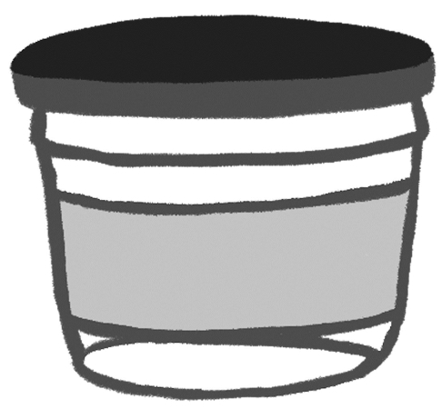
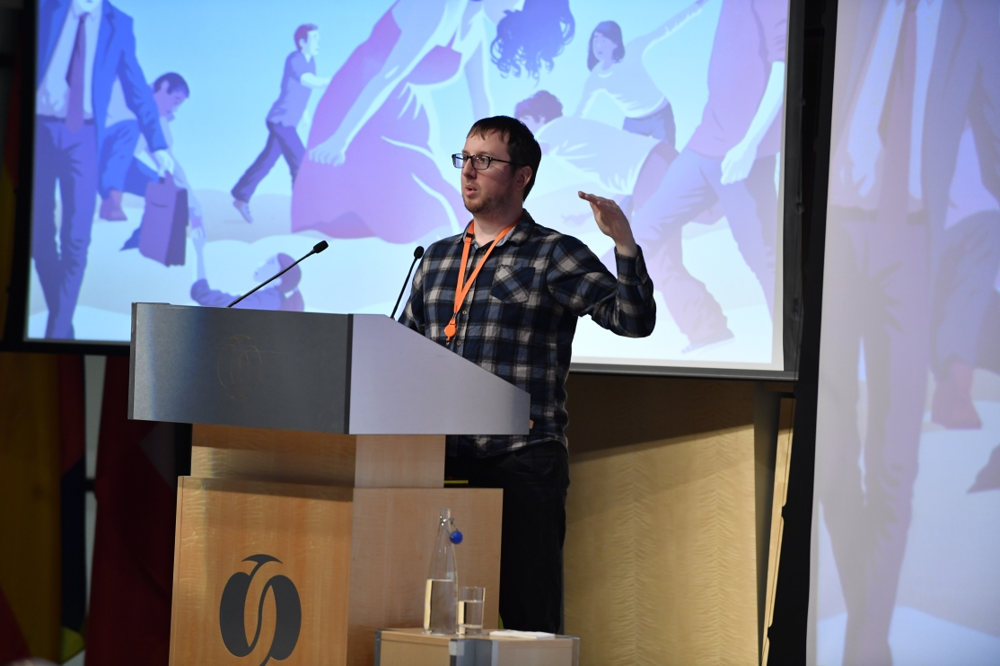

I rarely talk about my actual life on this site. So today, an update.

In short, it's fine.

But, in long, there are two big projects to update you on:

<!--more-->

## Another Book - And This One's a Novel

I wrote another book!

This one is an adventure set in the pre-life (a world like the afterlife, but _before_ we're born), all about the magical shop where humans choose what kind of person to be when they get born down on Earth.

Readers of [Walking on Custard](https://www.walkingoncustard.com/the-book-for-anxious-humans/) will recognise _The Shop Before Life_ from the very brief short story... but it turns out there's a whole world around the Shop to explore, full of mysteries to discover, and questions about life & death, and who we are, and who we become.

So far, the feedback has been absolutely lovely.

(If I may permit some mild showing off, one early reader said _"I want to make fan art of it. it's in my heart now."_ - how gorgeous is that?!)

Im very excited for you all to read it, so stay tuned for more soon!

## I'm Also Still Speaking

Of course, I literally speak with my mouth pretty much every day, but what I mean is that I'm still [giving talks](https://www.walkingoncustard.com/speaking/) at interesting places.

For a while I've been meaning to share some pictures from a fun talk I gave at the [EBRD](http://ebrd.com) HQ in London. It was a great day, with a delightful audience and some fantastic conversation around anxiety and managing our emotions.

As usual, every photo had me pulling a silly face, unnatural gesture, or often, both:

And I've really enjoyed giving talks in schools, too - with many more to come in 2018.

**If you would like someone to speak with humour about anxiety, mental health and happiness at your school, business, university, conference, etc**, then please [get in touch](https://www.walkingoncustard.com/contact/)!

## That's The Main Bits

I am also toying with whatever the next big project will be now that _The Shop Before Life_ is approaching the final stages.

But that will have to wait for another day.

Whatever you're up to, do feel free to say hello - and I hope your life is going well too :)
