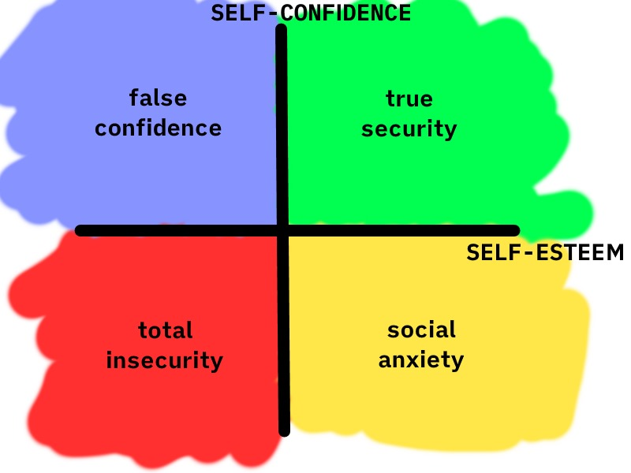

Have a look at this unbelievably fancy graph which I just spent five minutes doodling:

I don't know if it's universally true, but it does help me whenever I remember that _self-confidence_ and _self-esteem_ are **separate**. I think of them like this:

-   **_Self-esteem_** is, roughly, "how much we like ourselves"

-   **_Self-confidence_** is, roughly, "how much we imagine others like us"

Of course, these are certainly _related_. But there have been many times when I've felt confident about others liking me while disliking myself, or vice versa.

**_Self-esteem and self-confidence don't always move perfectly in step._**

I've been surprised to discover that somebody who appears confident struggles with negative feelings about themselves. They have self-confidence but not much self-esteem.

Meanwhile, people who are loving and forgiving towards themselves can still feel unconfident around others. They have self-esteem but not much self-confidence.

And, of course, there are those who lack both self-esteem AND self-confidence.

## **It's About Time**

Actually, I'm not quite saying this right. I'm saying "people lack" self-confidence or self-esteem like these are _things you can have_, or, worse, *parts of our personality*.

The phrase "I lack self-esteem" suggests that there's something missing in me. But esteem and confidence vary over time, and they change when circumstances change. They're not fundamental parts of me, unchanging like my height or eye colour.

Maybe it's better to think of it more like hunger. When I don't eat for a while, I get hungry. _But I don't make that part of my identity_. I recognise that I'm hungry because I haven't eaten for a while, not because "I am a permanently hungry person".

(I mean, I am very often hungry but you know what you mean.)

So when I'm lacking in self-confidence or self-esteem I find it healthier to recognise that it's not because some fundamental part of me is missing. Just like when I'm hungry and I need to eat, I need *something* to replenish my confidence or esteem.

And whatever I need is different depending on whether I'm missing self-esteem, which is about learning to love and forgive myself, or self-confidence, which is about learning to feel safe and be fully myself around others.

I would love to share a magic solution which always succeeds at topping up our self-esteem and/or self-confidence, but sometimes replenishing whatever I'm missing is hard work. I might have to change deeply-rooted beliefs about myself or about how other people view me. Other times it's simpler, and I just need to take a moment to remember positives about myself, or spend quality time with friends, or alone.

Either way, taking time to figure out what I'm missing and making a list of 'things that might help me meet this need' is a good start. And ideally, I'll get to live more of my life in the more secure area in the top right of that graph I doodled.
