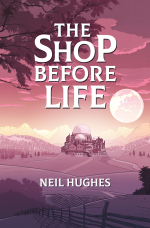

_“Never again.” - Neil Hughes, after writing one book_... _and before writing **another** book._

After winning four Olympic gold medals, Steve Redgrave [famously said](https://en.wikipedia.org/wiki/Steve_Redgrave) that if anyone found him close to a rowing boat again, they could shoot him.

Four years later, he won a fifth gold. 

<!--more-->

Let’s be real—I am not as good at writing as Steve Redgrave is at rowing. But after my first book came out, I knew how he felt. I wasn’t sure that I’d ever write another. 

Some writers say they couldn’t stop writing if they tried—they just love it _so_ much that even death might not stop them writing another book. I am not like those people.

For me, writing is an exercise in facing my own inadequacy, day after day after day, while constantly being taunted by others who are more talented than I. Writing something as massive as a book is months (at least) of self-punishment, with an uncertain, possibly even negative, reward.

And yet, I have written a second book.

One potential—and valid—conclusion from this is that I’m an idiot who has no idea what he wants. But after reflecting on the whole experience, I’ve been able to determine some more helpful lessons. Whether you’re working on one huge project or many smaller ones, I hope they’ll be helpful to you too.

### Lesson #1: There’s always a new challenge to be found, even in what appears to be a repeat project

Part of me wondered if I’d tick off “write a book” from my list of ambitions and never do it again. **I think this is actually a common fear: that we might do everything exactly once and move on.**

But there’s always something new to learn, even in a repeat project. For example, my [first book](https://enhughesiasm.com/woc) is non-fiction, while my [new book](https://enhughesiasm.com/sbl) is fiction and [each genre](https://www.walkingoncustard.com/how-to-choose-the-right-path-when-there-are-so-many-possibilities/) brings different challenges. In this case, I found it difficult to choose just one branch from the literally infinite possibilities for the story. I had to learn how to fix elements in place to craft the story I wanted to tell. 

Even if I were to attempt to write the exact same story again, it would be harder _not_ to challenge myself somehow. **My fear that doing the ‘same thing’ might lead to stagnation was unfounded.**

### Lesson #2: Internal resistance can be a positive signal

On the whole, I avoid unpleasant things, and I wasn’t keen on the difficulty of another big writing project. But some challenges become [more enticing due to their difficulty](https://puttylike.com/i-like-doing-hard-things/).

On reflection, a few factors have helped to decide whether to complete such huge, scary projects:

- Stretching: _Might this project take me out of my comfort zone, and how far? Not at all, a little growth… or too much difficulty?_

- Complete-ability: _given enough effort, can I do it?_

- The “work-to-eventual-satisfaction” ratio: _can the eventual completion justify the effort involved?_   

And perhaps the most important thing is being consistently drawn back. If an intimidating project keeps preying on my mind, and the answers to the above questions are positive, then I know now that it’s at least worth starting. After all, [we can always](https://puttylike.com/i-never-finish-anything-how-to-stop-feeling-guilty-about-all-of-your-unfinished-projects/) stop!

### Lesson #3: Perfect doesn’t exist, and that’s fine

For many projects—arguably _most_ projects?—there’s no such thing as “perfect.” I could tweak any piece of writing I’ve done over and over and over and over… _forever_. And there’s still no point when it is Officially Done.

As someone who likes an authority figure to come and pat me on the head and give me a sticker saying “full marks!”, this is a tough reality to come to terms with.

I expect this is a lesson I’ll have to learn repeatedly: “good enough” isn’t a destination, it’s a _range of destinations_. (And sometimes [“bad enough” is okay too](https://www.walkingoncustard.com/it's-okay-to-be-bad-at-things/)!)

This is particularly hard when there’s no right answer. I agonized for a long time over two nearly-identical options for my book’s cover, before I finally admitted to myself that the very fact I was agonizing over it so much meant that it definitely didn’t matter.

In future, if I’m choosing between two similar options I’ll try to remember that—by definition—they’re similar, and the choice ultimately won’t make much difference. It’s better to just choose one and not agonize for days on end over it!

For your interest, the cover ended up looking like this… and I _guarantee_ you wouldn’t be able to tell the difference from the “other” version:

### Lesson #4: Actively plan a fresh (and very different) project for when your current project ends

I've learned that once I finish a project, I need to do something very different. I can't pick up a similar project immediately. After my first book, I drifted. Many writers gave me the common advice: “start writing the next one.” But that felt like being advised to eat more dessert right after a whole dessert banquet.

This time, after finishing, I jumped straight into a very different project: a video game. This turned out to be perfect. I got to learn some new technology I’d been meaning to play with, and I designed it to tie into the book, so it still felt cohesive. (You can [play it here](https://enhughesiasm.com/complex) if you like!)

### Lesson #5: Judgement is less scary the second time around

When my first book came out—or the first time I hit ‘send’ on a blog post, or gave a performance on stage—it felt like my entire personality was going into the world to be judged.

Every time I do those things, I worry less about judgement. I’m not sure that I’m growing a thicker skin, exactly, but repeat exposure definitely makes it less scary.

I didn’t die when any less-positive reviews of the first book came in, so I know I won’t this time either. Those who love it, will love it; others won’t. It’s all fine.

### Lesson #6: Tell the world when you’ve done a thing!

I’m not sure where I absorbed the idea from, but whenever I do something, part of me feels as if it’s somehow _inappropriate_ to even mention it. Apparently, part of my brain believes I ought to spend years creating something, but then _never tell anyone_.

Many people share this sense of shame at saying “Hey, I worked hard on a thing–would you like to see it?” **But it’s not only _okay_ to share the thing, it’s _essential_.**

The reasons why we hide our work are many and varied. Perhaps we’re afraid people won’t like it, or that they’ll be confused that we’ve done something so different, or that we’ll no longer fit into an easy box in people’s minds anymore. Regardless of why, if we don’t share what we’ve made, those people who _would_ like it will never get a chance to enjoy it.

* * *

Whatever you’re doing right now—whether working on something big, or looking for a refresher, or struggling to share your own work—I hope there’s something useful in this for you.

(Oh, and if you’re interested, [you can check out the book here](https://enhughesiasm.com/sbl). And I’ll try not to cry if you hate it ;) )
