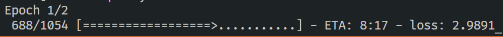
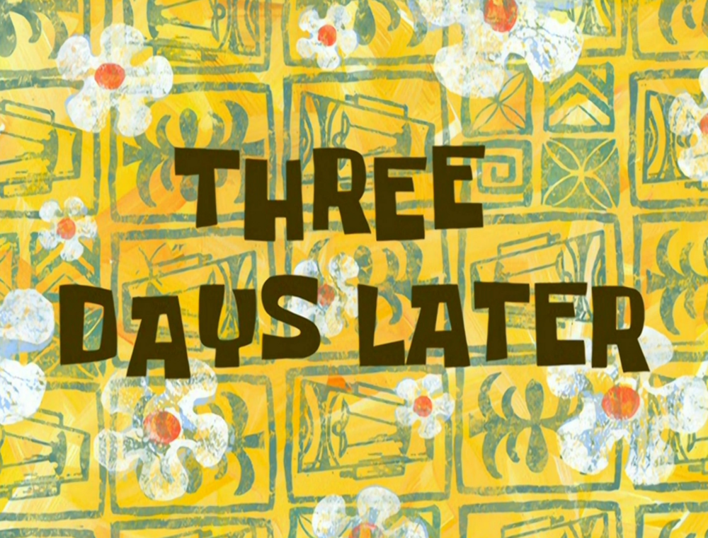

Every now and then I get sick of the fact that all my goals are massive, overwhelming and scary. It’d be nice to just _achieve_ something, for once. So I had an idea for a small, mini-project to [help me recharge](https://puttylike.com/6-experiments-to-help-you-recharge-when-youre-feeling-drained-and-weird/), and I thought it’d be fun to share the whole journey with you.

To date, I’ve written [over one hundred articles for Puttylike](https://puttylike.com/author/neilhughes4/). And I’ve been curious about computer-generated writing for years. So here’s the plan: I’m going to feed all my articles into an Artificial Intelligence and see if computers can learn to write like I do. I’m no expert in AI… but that’s precisely what makes this idea so enticing.

<!--more-->

## Stage zero: Expectations

One of the reasons my projects often balloon in scope is that I can’t bear the thought of doing anything imperfectly. So I’m consciously releasing myself from perfection before I even start. 

Ideally, my new AI friend will auto-generate a complete and comprehensible article, filled with pearls of wisdom and hilarious wit. But just generating _anything_ would be an achievement. The aim for this mini-project is simply to have fun while creating something.

My mantra will be this: s_omething imperfect that exists is better than something perfect that doesn’t!_

## Stage one: Learning

Mini-projects inevitably involve a lot of learning. A quick search reveals what I _don’t_ know about AI text generation, which – it turns out – is a lot! 

Happily, I always find the revealing-my-vast-ignorance-to-myself stage of projects enjoyable.

My initial plan is to harness the power of the biggest, coolest beast in the world of AI text generation: GPT3. This network generates impressively human-seeming output in all kinds of areas. Check out the poem [it wrote](http://gwern.net/GPT-3) — it's called _"Future Consensus Forecasts" by Board of Governors of the Federal Reserve System_:

_**No one knows what will come  
Forecasts foretell a rise in power  
That is probably not to be  
Deficit of several lines  
The golden future has tourniquets  
No one likes it**_

Sure, it’s nonsense, but it’s _fun_. I’m already anticipating what GPT3 will make out of my writing. 

Unfortunately, I hit an immediate stumbling block: GPT3 isn’t fully open to the public. 

And while filling in the form to join the waitlist, I decide that “automating my Puttylike articles” is probably not a good enough reason to make it into their exclusive program.

## Stage one-and-a-bit: Relearning

Trial and error is inevitable. My first idea didn’t work out, so I’ll find another way.

More googling reveals that it’s (relatively) easy to train your own neural network on some text. I won’t go too deeply into the technicalities, but the basic idea is that the network runs some advanced mathematics on whatever you feed it, and it figures out how to come up with new stuff that’s similar.

The disadvantage of doing this myself is that my network will lack the enormous power and sophistication of GPT3. I’m much more likely to end up with a bunch of nonsensical sentences than a plausible article which imitates my style.

However, the _advantage_ is that this is actually physically possible, which is a strong enough reason to go for it. _(Something imperfect that exists is better than something perfect that doesn’t!)_

I found a tutorial which passes my Useful Learning Test — i.e. it contains mostly things I already know and a small amount of things I don’t — and I’m going to go try it immediately.

## Stage two: Experimentation

As I write, a neural network is training itself on a small amount of test data. This is extremely exciting!

I’m watching this progress bar right now:

One yardstick for the power of these networks is their _number of parameters_, which is a bit like the size of their brains. My little home-made AI has a grand total of 2,939,141 parameters. Sounds good, right? Well, for comparison, GPT3 has _over 175 billion_ parameters.

A quick glance at [animal brain size](https://en.wikipedia.org/wiki/List_of_animals_by_number_of_neurons) shows that GPT3 apparently has more parameters than human brains have neurons, while my network has the comparative mental power of...a guppy. 

Unfortunately, even with this modest start, the test training will apparently take around 30 minutes on my machine. This is mildly concerning. At this speed, it looks like I might have to train the network on my articles for _several days_–once I’ve validated this actually works. 

I could spend some money and figure out how to get this running faster on the cloud, or do some magic to speed up the computations, but ‘imperfection is okay’.

Meanwhile, the training has completed. Let’s see the results.

## Stage three: Doing

The test data worked. Well, sort of. Here’s what I get back out of it when I ask for a new sentence:

_**Hovered ice fish could procured thus cut chief article maintenance triumph enemy increased difficulty …**_

It goes on like this for quite a while. It seems I have not yet replaced myself with a robot guppy.

I’m actually really happy with this result. I barely trained it — on the wrong data — and it came up with…some complete gibberish. But it’s basically what I expected. 

In theory, I can now train it on the _right_ data and for a proper length of time, and then I will discover what an AI makes out of the totality of my Puttylike articles.

I love these moments in a project. Realizing this is _actually_ possible is so exciting!

And with that, I’ll set it training on the real data. See you soon.

## Stage four: Results

Welcome back!

Imagine doing _nothing_ but reading my blog posts for days on end. I’ve thought about what that would feel like as I watched the progress bars gradually tick back and forth for the last three days.

Let’s see what effect it had on my AI. 

AI, give me a sentence.

**_non fiction writer world might custard physics mental health writer realised sime shings shings shings shings shings_**

Oh wow. I mean. It’s, uh… certainly grasped _something_ of the subjects I tend to mention. I’m not sure it has quite captured my writing _style._ But let’s try again, I suppose:

**_television actually paid attention experience might go something like joylessly scroll option shings shings shings shings shings shings shings shings shings shings_**

Hmmm. Well...

I see the AI has at least nailed my famous catchphrase, _shings shings shings shings shings_.  Although I think my delivery is better.

Let’s go one more time. Maybe this glitch doesn’t always happen?

**_scared fine super touch emotions identified dealt usual fears realised part us terrified caging for get sime shings shings shings_**

Well, fair enough. I can’t disagree.

## Stage five: Concluding

Was this project worth several days of my life?

I find this question impossible to answer. As always, I went in with hopes and dreams and a whole lot of ignorance. I learned plenty in the process (in particular, I learned how to teach a computer to repeatedly say “shings”), and I had a lot of fun documenting the journey.

Honestly, the results aren’t what I hoped for, but I suppose I knew that training my own network (potentially wrongly!) was always going to be worse than using a ‘real’ one. Maybe I’ll return to this project someday, if I manage to get access to GPT3 or a similar technology.

Or, maybe I’ll learn more about training networks and figure out how to make this one smarter! Perhaps instead of the brain size of a guppy I could try one the size of a mongoose! Or instead of training it on my own computer I’ll use some cloud computer to run 24/7 for a week. Or maybe…

You know what? Any project that ends with me filled with enthusiasm and brimming with ideas of how to improve it in the future is a success.

And one thing I’ve _always_ said about success is, _sime shings shings shings shi_
