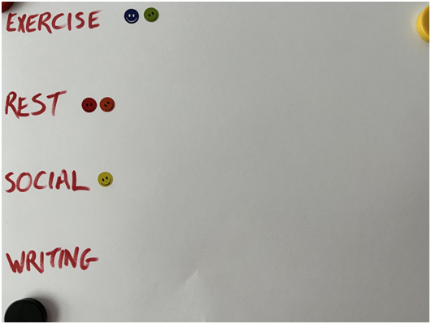
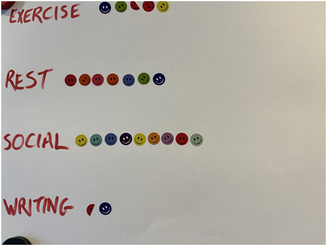

I don’t think I’ve ever ended a day with the thought “I got it _all_ done today!”

<!--more-->

You might think I would have grown accustomed to my ongoing failure to progress on everything at once, but I’ve been especially frustrated by this lately. Even on productive days, I can’t avoid guiltily remembering some task that I’ve not even touched for weeks.

My usual strategy is to self-criticise, as if that could inspire me to do _everything-PLUS-that-other-thing_ the next day. But this never works.

And recently I’ve realised why: doing everything every day is _impossible_.

## Prioritization is inevitable

The problem is that every day I have to prioritise my time. This means choosing a handful of activities from a list that looks something like this:

- My actual day job

- Chores / life admin.

- Exercise

- A social life

- Personal projects (naturally there are likely many of these!)

- Rest

Unfortunately, some of these items are non-optional, so the “choice” is partly an illusion. In particular, I have to do my job and I have to do chores (a broad category in which I’m including eating and sleeping and cleaning and taxes and shopping and so on).

By the time I’m done with those two, I’ve _maybe_ got time and energy to squeeze in one of the other categories. And since some of those are more attractive than others—it’s easier to see friends than to exercise, and it’s easier to rest than either of those—many plans get neglected for months at a time. 

I don’t normally think of this process in such stark terms. Until now, I think part of me has genuinely believed I have more freedom to choose what I’m doing than I do. But breaking it down in this way reveals a potential insight: **realistically, I can only choose about one optional category every day**. So what if I _accepted_ that fact? What if I _planned_ for it?

And so, I began an experiment.

## Doing just one (optional) thing

First, I picked some activities that have been easy to neglect lately. To keep it simple, I went with ‘exercise’, ‘social’, ‘rest’ and a single personal project, ‘writing’. 

Next, I bought a bunch of stickers.

The plan is that _every day_ for the next three-and-a-bit weeks I am going to ensure I make progress on one of these four optional areas.

## The Experiment: Day 0

The hope—and right now it is just a hope—is that I will balance out the time I spend on these four nonessential activities over the course of a few weeks. Ideally, noticing that I’ve neglected one will encourage me to refocus, to keep the sticker counts in equilibrium.

(I suppose I’m also secretly hoping that I’ll be inspired to earn more than one sticker on some days. However, I’m planning to count that as a bonus, if it happens. The target is simply to make progress on one thing every day.)

Let’s see how it goes.

## The Experiment: Day 5

Here’s my sticker board so far:

Please excuse the lack of artistic flair. When I made my board, I didn’t plan to take photos!

The results so far don’t surprise me. I’ve started out with some enthusiasm, and I was prioritising exercise even before this experiment began so I’m in the habit already.

The ‘zero’ against writing was also predictable. I always knew I would neglect it. After all, I have been procrastinating on this project for a long time. But instead of wrestling against the growing guilt, I have the simpler challenge of putting one—just one!—sticker on a page.

Perhaps I can even do that tomorrow?

## The Experiment: Day 6

Nope. I did not.

This is my first zero-sticker day. But that’s okay. This is an experiment, not a stick to beat myself with.

## The Experiment: Day 10

Finally—a WRITING sticker! 

That’s correct, I managed to sit down and write on a personal project. That’s a thousand words that I definitely would have avoided creating if not for this experiment!

## The Experiment: Day 16

I keep forgetting to take photos, but the current count is:

EXERCISE 3.5

REST 5

SOCIAL 6

WRITING 1.5

I’m genuinely amazed I’ve kept this going for so long, even once my initial enthusiasm died away. And with only one day without any progress!

You may be wondering about the half-stickers. There was one day where I felt sore halfway through a workout so I stopped. There are no rules about what constitutes a full sticker so I could have counted it, but I decided to use the excuse to write a few words and split the sticker. (Sure, it could have been two stickers, but it was fun to rip one up and stick it, so why deny myself that mild enjoyment?!)

## Surprising results

I had assumed that the exercise column would be full of stickers, and that I’d struggle to find social stickers. Perhaps my post-covid social life isn’t as moribund as I’d thought.

But perhaps the most encouraging discovery so far is that I have resisted the temptation to use ‘rest’ as a cynical excuse to be lazy. When I first added it as an option, I wondered if it would become a default freebie. It’s easy to cynically imagine my future self gleefully choosing ‘rest’ every day while pretending that represented real progress.

Instead, I’ve actually used ‘rest’ days to allow myself to switch off without worrying about being unproductive. There’s something about putting a sticker on the page that removes the usual guilt!

However, it is becoming clear that my initial aim to keep the counts balanced isn’t really happening. Again, I’m not beating myself up about this. Most of these stickers represent progress I wouldn’t have made otherwise.

## The End: Day 24

Here’s the final tally:

EXERCISE 4.5  
REST 7  
SOCIAL 9  
WRITING 1.5

I’m immediately going to draw two conclusions:

First, this was a surprisingly good idea. I thought I’d hate it, but it was fun and it inspired me to make some progress I otherwise wouldn’t have managed.

Second, as most experiments do, this one surfaced an unforeseen problem. When I did achieve something—like, say, doing a workout or organizing a social event—I mentally blocked off the day as “done,” which actively prevented me from doing more. This meant that being invited out basically stopped me from exercising or writing on that day, which wasn’t _really_ the initial intention.

However, I think now that I’m aware of this pitfall I would be more conscious about my approach if I tried this again. 

I found this so useful that right after I hit submit on this article I’m going to blank out that sheet of paper and go again, with a more conscious decision about what counts as earning a sticker. In particular, I wouldn’t count “freebies,” like a spontaneous invitation to a party. Or, if I did choose to count one, I’d aim to push myself to earn a second sticker on those days.

These tweaks aside, I’m so pleased that I overcame my lengthy writer’s block. This experiment is a huge success in my mind.

So, if you also feel stuck, like you’re making the same choices every day, or if you have some neglected projects gathering dust, perhaps it could help to quit attempting to do everything and instead aim to just do _one_ thing… for a short time. If you do try, please let me know how it goes so I can learn from your experience too.

Only one question remains: do I get a sticker for writing this article?

(The answer is no. I suppose I’d better find my gym bag…)

* * *

\[this article was originally written for [Puttylike](https://puttylike.com)\]
