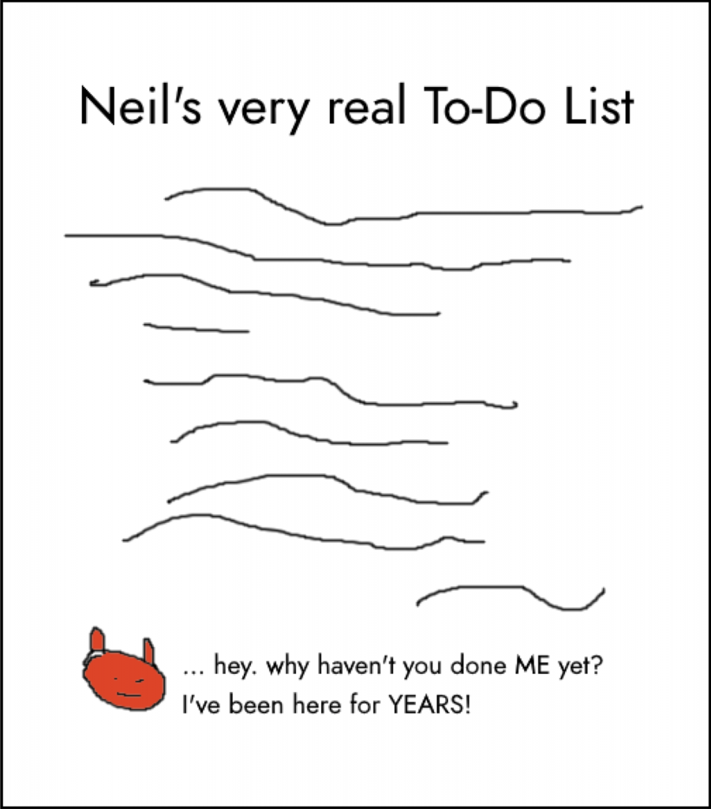

I have a love/hate relationship with lists.

<!--more-->

Lists appear in every facet of my life. There’s a long list of places I want to visit someday. I’ve got a list of TV shows I’ll get around to watching eventually. There’s another for emails I ought to send. And, of course, my days are dominated by constant interactions with my ever-changing To-Do list.

Most of the time, my list addiction doesn’t cause any problems. Each of these lists evolved as a solution to a problem, and they _mostly_ work well for me. But each list also has a tendency to accumulate items which inflict repeated psychic damage on me each time I take a glance.

**This accumulation of undone items causes a constant low-level friction which grinds away at my motivation and gradually inflates my background guilt**. I want to explore where the worst of these items arise from, and then I’m going to share the most powerful way I’ve found so far to banish them—and the related guilt—forever.

## The danger of “coulds” that become “shoulds”

The origin of most of these accumulated items is no mystery. I simply write down something I’d like to do with the expectation that I’ll get around to it at some point. 

Generally these are small tasks, like _fix dripping tap_, and the reality is that I’ll either do them eventually or not. The nature of these little tasks is that it doesn’t matter too much either way.

But the more dangerous and insidious items on my To-Do list are different. These aren’t little improvements I could either make or live without. They’re potential ambitions which have morphed from _could_ into _should_ without my noticing.

Have you ever started to believe you ought to do something, just because it’s theoretically possible that you could? This happens to me quite a lot, most often after I’ve been inspired by somebody else. For example, a friend might make a cool album of electronic music in their home studio, and I start to imagine doing the same. I mentally picture the fun of buying some equipment and learning to use the software. I imagine making a few tracks and sharing them. Maybe I start to envisage the cover art… and, before I know it, “Make an album” has ended up sitting on my To-Do List.

From then on, every time I glance at my list to see what I need to do today, I’ll be greeted by this hefty, intimidating task. Unfortunately, the initial fun of the fantasy has been replaced by inertia, and a sense that I should probably make some progress… soon. But part of me knows, or believes, that I won’t. And the belief that simply keeping this task on my list may be a way of lying to myself makes me feel guilty.

This process repeats. Before long, every time I look at my list I’m greeted by an ever-accumulating pile of potential projects, each of which whispers to me that I’m a fraud who never makes any progress.

Clearly, this isn’t the emotional relationship I’d like to have with an everyday item like my To-Do list. But what can be done about it?

## From _To-Do_ to _Won’t-Do_

Generally, once I get sufficiently fed up with a list reaching this guilt-inducing state, I give up: throw the list out and start again from scratch. This eliminates the painful jabs every time I open the list, but it feels like an incomplete solution. Lately I’ve been wondering about being more proactive when clearing my metaphorical desk, and this has led me to explore the concept of a Won’t-Do List.

A Won’t-Do List is exactly what it sounds like: a physical list of things that I have no intention of doing. At first this idea may sound silly, or even impossible – after all, the list of things I’m _not_ going to do is infinitely long.

But the act of consciously choosing to recategorise a task from “I’ll get around to this eventually” to “You know what? I’m _never_ going to do this” is freeing. This makes writing a Won’t-Do List emotionally different from simply throwing out a stressful To-Do list. Instead of an admission of defeat, writing a Won’t-Do List is the opposite: I’m actively releasing myself from commitments.

Some of these releases come easily. Sometimes an item has been on my To-Do list for so long that there’s nothing but relief when I finally acknowledge to myself that I’m simply not going to do it. But sometimes letting go of a task involves admitting that I’ve been deluding myself.

For example, I might have to admit that “making an album” was never something I truly wanted. Consciously analysing it may lead to the realization that I just thought something would be cool in a passing way and then _spent a year_ feeling guilty about never actually doing it. If I’m honest, this process of letting go makes me feel a little silly, but it’s also hugely relieving to recognise that the Won’t-Do List is the correct place for certain tasks or projects.

## Making a Won’t-Do list

Theoretically, a “Won’t-Do” list would be infinitely long. For example, I’m never going to be an astronaut or a professional athlete. But there’s not much point in writing either of those down, so I suggest only adding items that are specifically useful to let go of.

Here are some indicators that an item could be a good candidate to feature on your Won’t-Do List:

- A task which has been nagging at you for a long time without there ever being enough motivation to start or make progress.

- Any unnecessary tasks which you only consider doing because _other people_ think you ought to.

- Anything you can’t realistically do. It’s never easy to let go of an ambition, but if it’s genuinely not possible then it may be better to release yourself from the idea than to torture yourself with an impossible dream.

- Any task where the thought of letting go of it brings nothing but relief.

- Anything we used to want to do, but no longer want. Sometimes our present selves can feel bound to stick to something just because our past self wanted it. But we can choose to let go of old desires.

## Some surprising benefits of a Won’t-Do list

Along with shrinking our To-Do lists and removing those insidious guilt-inducing _shoulds_, there are some additional advantages to creating a Won’t-Do list.

For example, I found that removing my Won’t-Dos provided a real energy boost for my other projects. I could feel a clear emotional contrast between the items I moved to my Won’t-Do list and those that remained on the To-Do list. One such contrast was that getting rid of the pretend desire to “make an album” affirmed that “write another book” is a genuine and real desire. This makes me feel inspired to go and _actually work on it_.

Furthermore, one of my persistent self-criticisms is that I’m too easily seduced by new ideas. But I found that consciously listing things that I’m not going to do dampened that particular inner criticism. It proved to me that, despite what I sometimes believe, I’m not _actually_ interested in everything completely equally. As silly as it may sound, it felt good to recognise that some of my passions are deeper than others. Writing my Won’t Do List brought clarity to my current priorities, in a way which I didn’t expect.

## It doesn’t even have to be a list

Even as a confessed lover of lists, I must acknowledge that they’re not always thrilling. And I will admit that writing a Won’t-Do list could sound like quite a negative, depressing suggestion.

Luckily, the power of this technique isn’t in the format of the list, it’s in the act of making conscious decisions to decline possibilities. This means we don’t have to write a literal list. Instead, we could make the process fun and creative, perhaps by writing an “I Won’t Do These” poem. Or a song. Or a series of doodles.

Personally, I found it freeing enough to just move items from my To-Do list to a new Won’t-Do List. But I do like the idea of making it a creative act in itself. Maybe I’ll try that next time.

However you choose to engage with the idea, I can vouch from experience that spending a short amount of time writing a Won’t Do-List can be inspirational, and it has helped to re-engage me with all of the projects I _do_ truly want to do. And one thing I’ll definitely aim to Not Do is to allow my To-Dos to accumulate guilt-inducing _shoulds_ ever again.
